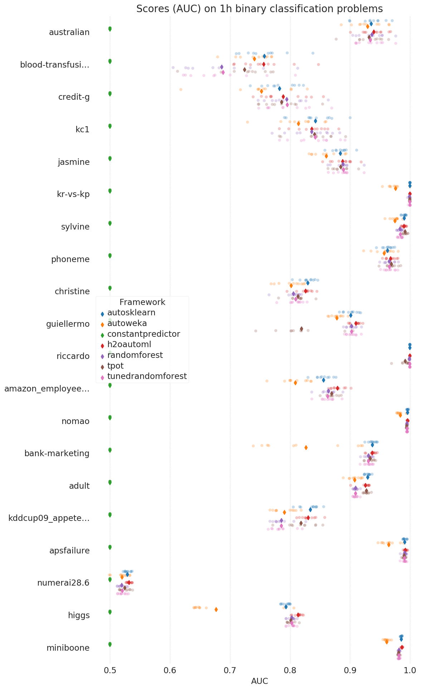
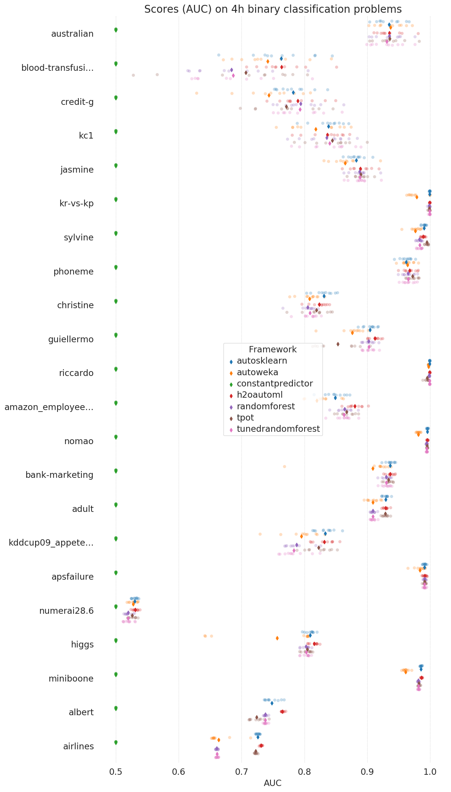
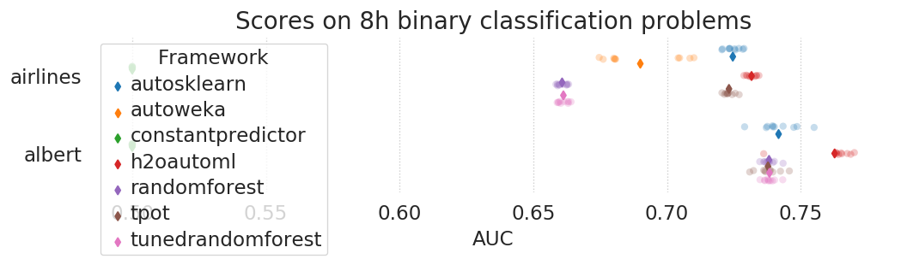
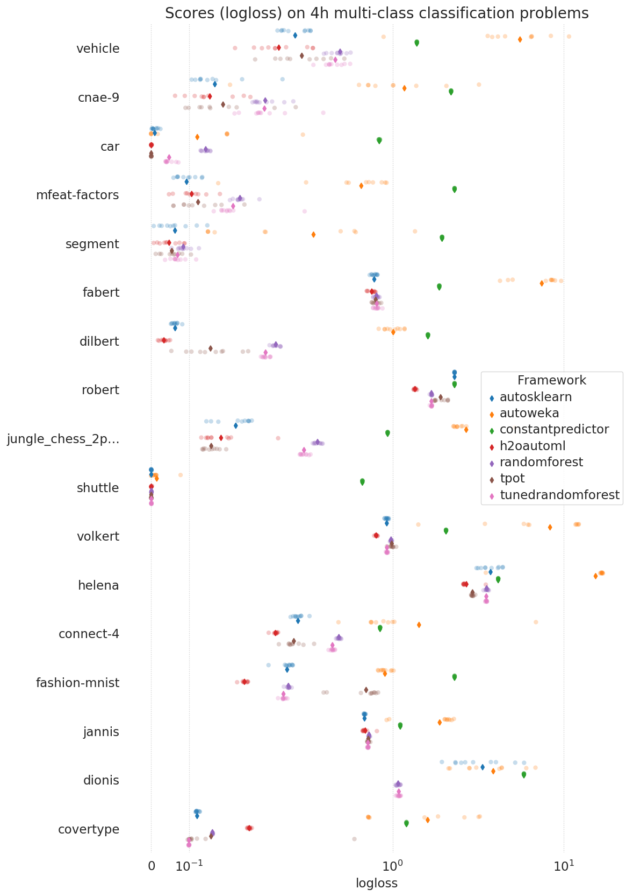
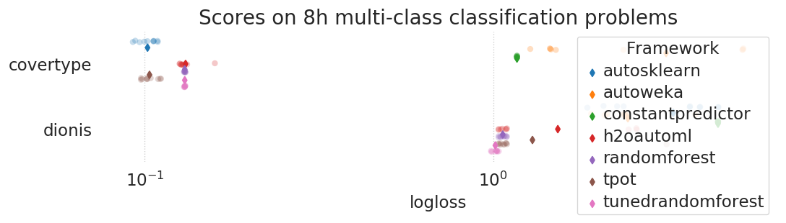
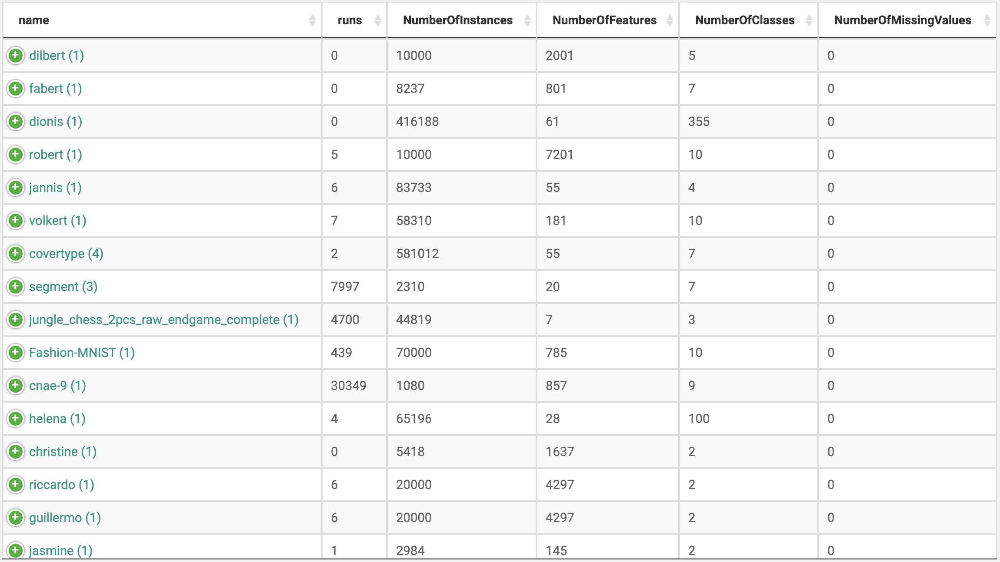
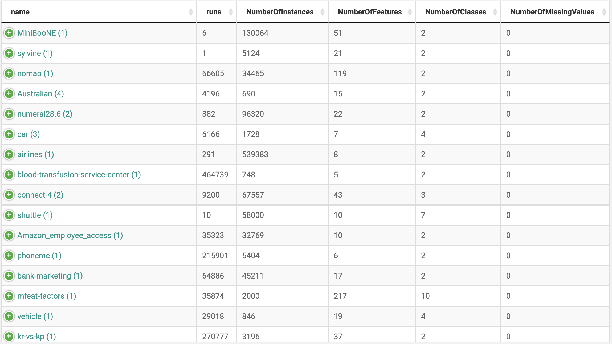
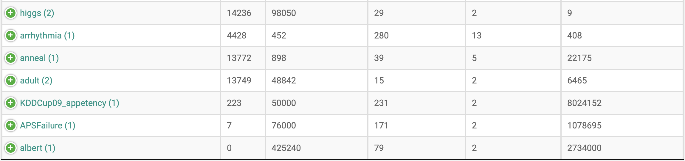

# AutoML Benchmark

自动机器学习(Automated Machine Learninng, AutoML)系统能够以数据驱动、客观公正、自动化的方式构建机器学习pipeline或者神经网络架构，使得机器学习系统中很多费时耗力的繁琐工作自动化，从而研发出更好、更快的系统。目前，AutoML研究遇到以下阻碍：

- We currently lack standardized, easily-accessible benchmarking suites of tasks (datasets) that are curated to reflect important problem domains, practical to use, and sufficiently challenging to support a rigorous analysis of performance results.
- Subtle differences in the problem definition, such as the design of the hyperparameter search space or the way time budgets are defined, can drastically alter a task’s difficulty. This issue makes it difficult to reproduce published research and compare results from different papers.

自动机器学习系统之间的对比、评估框架，框架中集成了几个开源AutoML系统，也可以自定义自己的数据和AutoML系统。

### AutoML Benchmark设计

主要逻辑：

1. 加载具体的framework和benchmark
2. 提取出tasks，并配置这些tasks
3. 为每个task创建jobs
4. 运行这些jobs
5. 采集并保存运行的结果

### AutoML系统和Baseline

已经集成的AutoML系统包括：

- [auto-sklearn](https://openml.github.io/automlbenchmark/automl_overview.html#auto-sklearn)
- [Auto-WEKA](https://openml.github.io/automlbenchmark/automl_overview.html#auto-weka)
- [H2O AutoML](https://openml.github.io/automlbenchmark/automl_overview.html#h2o-automl)
- [TPOT](https://openml.github.io/automlbenchmark/automl_overview.html#tpot)

其它值得考虑对比的AutoML系统：

- [autoxgboost](https://openml.github.io/automlbenchmark/automl_overview.html#autoxgboost)
- [GAMA](https://openml.github.io/automlbenchmark/automl_overview.html#gama)
- [hyperopt-sklearn](https://openml.github.io/automlbenchmark/automl_overview.html#hyperopt-sklearn)
- [ML-Plan](https://openml.github.io/automlbenchmark/automl_overview.html#ml-plan)
- [oboe](https://openml.github.io/automlbenchmark/automl_overview.html#oboe)

进行对比评估的baseline：

- [Constant Predictor](https://openml.github.io/automlbenchmark/automl_overview.html#constant-predictor)
- [Random Forest](https://openml.github.io/automlbenchmark/automl_overview.html#random-forest)
- [Tuned Random Forest](https://openml.github.io/automlbenchmark/automl_overview.html#tuned-random-forest)

### 对比评估结果

#### 二分类任务

评估指标：AUC。各AutoML系统在每个数据集上运行10次。在较小和中等大小的数据集上分别训练1小时和4小时，在更大的数据集上训练4小时和8小时。

详细数据见：https://github.com/openml/automlbenchmark

- 训练1小时的AUC对比

  

- 训练4小时的AUC对比

  

- 训练8小时的AUC对比

  

#### 多分类任务

评估对比指标：logloss。各AutoML系统在每个数据集上运行10次。在较小和中等大小的数据集上分别训练1小时和4小时，在更大的数据集上训练4小时和8小时。

- 训练1小时的AUC对比

  

- 训练4小时的AUC对比

  

- 训练8小时的AUC对比

  

### Benchmark Datasets

目标是使包含的数据集能够代表真实世界数据科学问题。选取的数据集应包括不同的大小、不同的数据类型，涉及不同的任务类型和任务复杂度，且不能被AutoML系统内部间接使用过(例如，元知识的形式)。

数据集来源： [OpenML100](https://www.openml.org/s/14), [OpenML-CC18](https://www.openml.org/s/98) and [AutoML Challenges](http://automl.chalearn.org/data)

#### 数据集选择标准

- 复杂性。数据集对应的学习任务应该足够复杂，不能被某一个基础算法就轻易的解决了。
- 对真实世界的代表性。代表实践中遇到的问题，限制人造数据集和图像数据集的数量。
- 多样性。问题涉及领域的多样性。例如，在OpenML-CC18 ( [jm1](https://www.openml.org/d/1053), [kc1](https://www.openml.org/d/1067), [kc2](https://www.openml.org/d/1063), [pc1](https://www.openml.org/d/1068), [pc3](https://www.openml.org/d/1050), [pc4](https://www.openml.org/d/1049))中有很多软件质量领域的数据集，过多的采纳某一领域数据集，会导致benchmark的领域偏差。
- 其它。提出具有标签泄露的(label-leakage)、近乎重复的(例如，支持类别编码的不同)和不满足独立性i.i.d.假设的数据集。
- benchmark中的数据集也会随着时间和新问题领域数据集的出现进行替换和更新。例如加入超过10万行的数据集。

#### 选择的数据集

- 二分类和多分类任务

  [39个数据集](https://www.openml.org/search?q=tags.tag%3Astudy_218&type=data&table=1&size=39)。

  

  
  
  


### 如何使用Benchmark

#### 测试环境搭建

```sh
删除./venv文件夹，重新搭建环境

git clone https://github.com/openml/automlbenchmark.git
cd automlbenchmark

python3 -m venv ./venv
source venv/bin/activate

pip3 install -r requirements.txt
报错：
numpy is required during installation

----------------------------------------
Command "python setup.py egg_info" failed with error code 1 in /private/var/folders/20/hvx7k0jd3ll7100hrgrsdng40000gn/T/pip-install-qgakds78/openml/
You are using pip version 10.0.1, however version 20.0.2 is available.
You should consider upgrading via the 'pip install --upgrade pip' command.

进行pip升级
pip install --upgrade pip   # 成功升级 Successfully installed pip-20.0.2

再次执行：pip3 install -r requirements.txt


仍然报错：
ERROR: Command errored out with exit status 1:
     command: /Users/levine/03-GitRepo/00-LevineHuang/automlbenchmark/venv/bin/python3 -c 'import sys, setuptools, tokenize; sys.argv[0] = '"'"'/private/var/folders/20/hvx7k0jd3ll7100hrgrsdng40000gn/T/pip-install-jbiu3_cj/openml/setup.py'"'"'; __file__='"'"'/private/var/folders/20/hvx7k0jd3ll7100hrgrsdng40000gn/T/pip-install-jbiu3_cj/openml/setup.py'"'"';f=getattr(tokenize, '"'"'open'"'"', open)(__file__);code=f.read().replace('"'"'\r\n'"'"', '"'"'\n'"'"');f.close();exec(compile(code, __file__, '"'"'exec'"'"'))' egg_info --egg-base /private/var/folders/20/hvx7k0jd3ll7100hrgrsdng40000gn/T/pip-install-jbiu3_cj/openml/pip-egg-info
         cwd: /private/var/folders/20/hvx7k0jd3ll7100hrgrsdng40000gn/T/pip-install-jbiu3_cj/openml/
    Complete output (1 lines):
    numpy is required during installation
    ----------------------------------------
ERROR: Command errored out with exit status 1: python setup.py egg_info Check the logs for full command output.

原因：numpy没有安装，尝试强制按requirements.txt中的顺序进行安装
执行：xargs -L 1 pip install < requirements.txt

未报错，安装成功！
Successfully installed Babel-2.8.0 PyYAML-5.3 attrs-19.3.0 certifi-2019.11.28 chardet-3.0.4 debtcollector-2.0.0 decorator-4.4.2 fasteners-0.15 idna-2.9 importlib-metadata-1.5.0 ipython-genutils-0.2.0 iso8601-0.1.12 jsonschema-3.2.0 jupyter-core-4.6.3 mock-4.0.2 monotonic-1.5 nbformat-5.0.4 netaddr-0.7.19 netifaces-0.10.9 nose-1.3.7 openml-0.7.0 oslo.concurrency-4.0.1 oslo.config-8.0.1 oslo.i18n-4.0.0 oslo.utils-4.1.0 pbr-5.4.4 pyparsing-2.4.6 pyrsistent-0.15.7 requests-2.23.0 rfc3986-1.3.2 stevedore-1.32.0 traitlets-4.3.3 wrapt-1.12.1 xmltodict-0.12.0 zipp-3.1.0


根据官网介绍，可能需要进行一下操作。
本次在Mac系统上未进行该操作，环境也搭建成功了。
enforce the pip3 version above in your virtualenv: pip3 install --upgrade pip==19.3.1.


继续安装 auto-sklearn==0.6.0
pip install auto-sklearn==0.6.0  # scikit_learn被自动从0.19.2升级为0.21.3
在安装pyrfr时报错：

Running setup.py install for pyrfr ... error
    ERROR: Command errored out with exit status 1:
     command: /Users/levine/03-GitRepo/00-LevineHuang/automlbenchmark/venv/bin/python3 -u -c 'import sys, setuptools, tokenize; sys.argv[0] = '"'"'/private/var/folders/20/hvx7k0jd3ll7100hrgrsdng40000gn/T/pip-install-qt_t9qz6/pyrfr/setup.py'"'"'; __file__='"'"'/private/var/folders/20/hvx7k0jd3ll7100hrgrsdng40000gn/T/pip-install-qt_t9qz6/pyrfr/setup.py'"'"';f=getattr(tokenize, '"'"'open'"'"', open)(__file__);code=f.read().replace('"'"'\r\n'"'"', '"'"'\n'"'"');f.close();exec(compile(code, __file__, '"'"'exec'"'"'))' install --record /private/var/folders/20/hvx7k0jd3ll7100hrgrsdng40000gn/T/pip-record-h8np8ybq/install-record.txt --single-version-externally-managed --compile --install-headers /Users/levine/03-GitRepo/00-LevineHuang/automlbenchmark/venv/include/site/python3.7/pyrfr
         cwd: /private/var/folders/20/hvx7k0jd3ll7100hrgrsdng40000gn/T/pip-install-qt_t9qz6/pyrfr/
    Complete output (15 lines):
    running install
    running build_ext
    building 'pyrfr._regression' extension
    swigging pyrfr/regression.i to pyrfr/regression_wrap.cpp
    swig -python -c++ -modern -features nondynamic -I./include -o pyrfr/regression_wrap.cpp pyrfr/regression.i
    creating build
    creating build/temp.macosx-10.7-x86_64-3.7
    creating build/temp.macosx-10.7-x86_64-3.7/pyrfr
    gcc -Wno-unused-result -Wsign-compare -Wunreachable-code -DNDEBUG -g -fwrapv -O3 -Wall -Wstrict-prototypes -I/Users/levine/anaconda3/include -arch x86_64 -I/Users/levine/anaconda3/include -arch x86_64 -I./include -I/Users/levine/03-GitRepo/00-LevineHuang/automlbenchmark/venv/include -I/Users/levine/anaconda3/include/python3.7m -c pyrfr/regression_wrap.cpp -o build/temp.macosx-10.7-x86_64-3.7/pyrfr/regression_wrap.o -O2 -std=c++11
    warning: include path for stdlibc++ headers not found; pass '-std=libc++' on the command line to use the libc++ standard library instead [-Wstdlibcxx-not-found]
    pyrfr/regression_wrap.cpp:3093:10: fatal error: 'stdexcept' file not found
    #include <stdexcept>
             ^~~~~~~~~~~
    1 warning and 1 error generated.
    error: command 'gcc' failed with exit status 1
    ----------------------------------------
ERROR: Command errored out with exit status 1: /Users/levine/03-GitRepo/00-LevineHuang/automlbenchmark/venv/bin/python3 -u -c 'import sys, setuptools, tokenize; sys.argv[0] = '"'"'/private/var/folders/20/hvx7k0jd3ll7100hrgrsdng40000gn/T/pip-install-qt_t9qz6/pyrfr/setup.py'"'"'; __file__='"'"'/private/var/folders/20/hvx7k0jd3ll7100hrgrsdng40000gn/T/pip-install-qt_t9qz6/pyrfr/setup.py'"'"';f=getattr(tokenize, '"'"'open'"'"', open)(__file__);code=f.read().replace('"'"'\r\n'"'"', '"'"'\n'"'"');f.close();exec(compile(code, __file__, '"'"'exec'"'"'))' install --record /private/var/folders/20/hvx7k0jd3ll7100hrgrsdng40000gn/T/pip-record-h8np8ybq/install-record.txt --single-version-externally-managed --compile --install-headers /Users/levine/03-GitRepo/00-LevineHuang/automlbenchmark/venv/include/site/python3.7/pyrfr Check the logs for full command output.

尝试单独安装pyrfr
pip install pyrfr  # 仍然报上一步相同错误

参考链接https://github.com/automl/auto-sklearn/issues/360#issuecomment-335150470，
自己下载pyrfr包，修改参数后，手动安装。
1. 从PYPI下载pyrfr-0.8.0.tar.gz，解压
2. 修改setup.py文件，
just change the following line:
extra_compile_args = ['-O2', '-std=c++11']
into:
extra_compile_args = ['-O2', '-std=c++11', '-stdlib=libc++', '-mmacosx-version-min=10.7']

确保处于venv环境中。source venv/bin/activate
sudo python setup.py install  # 经验证，能正常import pyrfr

## 安装过程日志如下：
running install
running build_ext
building 'pyrfr._regression' extension
swigging pyrfr/regression.i to pyrfr/regression_wrap.cpp
swig -python -c++ -modern -features nondynamic -I./include -o pyrfr/regression_wrap.cpp pyrfr/regression.i
creating build
creating build/temp.macosx-10.7-x86_64-3.7
creating build/temp.macosx-10.7-x86_64-3.7/pyrfr
gcc -Wno-unused-result -Wsign-compare -Wunreachable-code -DNDEBUG -g -fwrapv -O3 -Wall -Wstrict-prototypes -I/Users/levine/anaconda3/include -arch x86_64 -I/Users/levine/anaconda3/include -arch x86_64 -I./include -I/Users/levine/03-GitRepo/00-LevineHuang/automlbenchmark/venv/include -I/Users/levine/anaconda3/include/python3.7m -c pyrfr/regression_wrap.cpp -o build/temp.macosx-10.7-x86_64-3.7/pyrfr/regression_wrap.o -O2 -std=c++11 -stdlib=libc++ -mmacosx-version-min=10.7
In file included from pyrfr/regression_wrap.cpp:3172:
In file included from ./include/rfr/trees/k_ary_tree.hpp:26:
In file included from ./include/rfr/forests/regression_forest.hpp:21:
In file included from ./include/cereal/archives/json.hpp:56:
./include/cereal/external/rapidjson/document.h:597:9: warning: 'GenericValue' has a non-throwing exception specification but can still throw [-Wexceptions]
        CEREAL_RAPIDJSON_ASSERT(type <= kNumberType);
        ^
./include/cereal/archives/json.hpp:46:3: note: expanded from macro 'CEREAL_RAPIDJSON_ASSERT'
  throw ::cereal::RapidJSONException("rapidjson internal assertion failure: " #x); }
  ^
./include/cereal/external/rapidjson/document.h:2357:66: note: in instantiation of member function 'rapidjson::GenericValue<rapidjson::UTF8<char>, rapidjson::MemoryPoolAllocator<rapidjson::CrtAllocator>
      >::GenericValue' requested here
    bool StartObject() { new (stack_.template Push<ValueType>()) ValueType(kObjectType); return true; }
                                                                 ^
./include/cereal/external/rapidjson/reader.h:1671:77: note: in instantiation of member function 'rapidjson::GenericDocument<rapidjson::UTF8<char>, rapidjson::MemoryPoolAllocator<rapidjson::CrtAllocator>,
      rapidjson::CrtAllocator>::StartObject' requested here
            bool hr = (dst == IterativeParsingObjectInitialState) ? handler.StartObject() : handler.StartArray();
                                                                            ^
./include/cereal/external/rapidjson/reader.h:1832:39: note: in instantiation of function template specialization 'rapidjson::GenericReader<rapidjson::UTF8<char>, rapidjson::UTF8<char>,
      rapidjson::CrtAllocator>::Transit<272, rapidjson::BasicIStreamWrapper<std::__1::basic_istream<char, std::__1::char_traits<char> > >, rapidjson::GenericDocument<rapidjson::UTF8<char>,
      rapidjson::MemoryPoolAllocator<rapidjson::CrtAllocator>, rapidjson::CrtAllocator> >' requested here
            IterativeParsingState d = Transit<parseFlags>(state, t, n, is, handler);
                                      ^
./include/cereal/external/rapidjson/reader.h:487:20: note: in instantiation of function template specialization 'rapidjson::GenericReader<rapidjson::UTF8<char>, rapidjson::UTF8<char>,
      rapidjson::CrtAllocator>::IterativeParse<272, rapidjson::BasicIStreamWrapper<std::__1::basic_istream<char, std::__1::char_traits<char> > >, rapidjson::GenericDocument<rapidjson::UTF8<char>,
      rapidjson::MemoryPoolAllocator<rapidjson::CrtAllocator>, rapidjson::CrtAllocator> >' requested here
            return IterativeParse<parseFlags>(is, handler);
                   ^
./include/cereal/external/rapidjson/document.h:2159:40: note: in instantiation of function template specialization 'rapidjson::GenericReader<rapidjson::UTF8<char>, rapidjson::UTF8<char>,
      rapidjson::CrtAllocator>::Parse<272, rapidjson::BasicIStreamWrapper<std::__1::basic_istream<char, std::__1::char_traits<char> > >, rapidjson::GenericDocument<rapidjson::UTF8<char>,
      rapidjson::MemoryPoolAllocator<rapidjson::CrtAllocator>, rapidjson::CrtAllocator> >' requested here
        parseResult_ = reader.template Parse<parseFlags>(is, *this);
                                       ^
./include/cereal/external/rapidjson/document.h:2185:16: note: in instantiation of function template specialization 'rapidjson::GenericDocument<rapidjson::UTF8<char>,
      rapidjson::MemoryPoolAllocator<rapidjson::CrtAllocator>, rapidjson::CrtAllocator>::ParseStream<272, rapidjson::UTF8<char>, rapidjson::BasicIStreamWrapper<std::__1::basic_istream<char,
      std::__1::char_traits<char> > > >' requested here
        return ParseStream<kParseDefaultFlags, Encoding, InputStream>(is);
               ^
./include/cereal/archives/json.hpp:427:21: note: in instantiation of function template specialization 'rapidjson::GenericDocument<rapidjson::UTF8<char>,
      rapidjson::MemoryPoolAllocator<rapidjson::CrtAllocator>, rapidjson::CrtAllocator>::ParseStream<rapidjson::BasicIStreamWrapper<std::__1::basic_istream<char, std::__1::char_traits<char> > > >'
      requested here
        itsDocument.ParseStream<>(itsReadStream);
                    ^
./include/cereal/external/rapidjson/document.h:592:14: note: function declared non-throwing here
    explicit GenericValue(Type type) CEREAL_RAPIDJSON_NOEXCEPT : data_() {
             ^                       ~~~~~~~~~~~~~~~~~~~~~~~~~
./include/cereal/external/rapidjson/document.h:756:9: warning: 'operator=' has a non-throwing exception specification but can still throw [-Wexceptions]
        CEREAL_RAPIDJSON_ASSERT(this != &rhs);
        ^
./include/cereal/archives/json.hpp:46:3: note: expanded from macro 'CEREAL_RAPIDJSON_ASSERT'
  throw ::cereal::RapidJSONException("rapidjson internal assertion failure: " #x); }
  ^
./include/cereal/external/rapidjson/document.h:2162:24: note: in instantiation of member function 'rapidjson::GenericValue<rapidjson::UTF8<char>, rapidjson::MemoryPoolAllocator<rapidjson::CrtAllocator>
      >::operator=' requested here
            ValueType::operator=(*stack_.template Pop<ValueType>(1));// Move value from stack to document
                       ^
./include/cereal/external/rapidjson/document.h:2185:16: note: in instantiation of function template specialization 'rapidjson::GenericDocument<rapidjson::UTF8<char>,
      rapidjson::MemoryPoolAllocator<rapidjson::CrtAllocator>, rapidjson::CrtAllocator>::ParseStream<272, rapidjson::UTF8<char>, rapidjson::BasicIStreamWrapper<std::__1::basic_istream<char,
      std::__1::char_traits<char> > > >' requested here
        return ParseStream<kParseDefaultFlags, Encoding, InputStream>(is);
               ^
./include/cereal/archives/json.hpp:427:21: note: in instantiation of function template specialization 'rapidjson::GenericDocument<rapidjson::UTF8<char>,
      rapidjson::MemoryPoolAllocator<rapidjson::CrtAllocator>, rapidjson::CrtAllocator>::ParseStream<rapidjson::BasicIStreamWrapper<std::__1::basic_istream<char, std::__1::char_traits<char> > > >'
      requested here
        itsDocument.ParseStream<>(itsReadStream);
                    ^
./include/cereal/external/rapidjson/document.h:755:19: note: function declared non-throwing here
    GenericValue& operator=(GenericValue& rhs) CEREAL_RAPIDJSON_NOEXCEPT {
                  ^                            ~~~~~~~~~~~~~~~~~~~~~~~~~
In file included from pyrfr/regression_wrap.cpp:3172:
In file included from ./include/rfr/trees/k_ary_tree.hpp:26:
In file included from ./include/rfr/forests/regression_forest.hpp:21:
./include/cereal/archives/json.hpp:535:42: warning: private field 'itsValueItEnd' is not used [-Wunused-private-field]
          ValueIterator itsValueItBegin, itsValueItEnd;    //!< The value iterator (array)
                                         ^
3 warnings generated.
creating build/lib.macosx-10.7-x86_64-3.7
creating build/lib.macosx-10.7-x86_64-3.7/pyrfr
g++ -bundle -undefined dynamic_lookup -L/Users/levine/anaconda3/lib -arch x86_64 -L/Users/levine/anaconda3/lib -arch x86_64 -arch x86_64 build/temp.macosx-10.7-x86_64-3.7/pyrfr/regression_wrap.o -o build/lib.macosx-10.7-x86_64-3.7/pyrfr/_regression.cpython-37m-darwin.so
clang: warning: libstdc++ is deprecated; move to libc++ with a minimum deployment target of OS X 10.9 [-Wdeprecated]
building 'pyrfr._util' extension
swigging pyrfr/util.i to pyrfr/util_wrap.cpp
swig -python -c++ -modern -features nondynamic -I./include -o pyrfr/util_wrap.cpp pyrfr/util.i
gcc -Wno-unused-result -Wsign-compare -Wunreachable-code -DNDEBUG -g -fwrapv -O3 -Wall -Wstrict-prototypes -I/Users/levine/anaconda3/include -arch x86_64 -I/Users/levine/anaconda3/include -arch x86_64 -I./include -I/Users/levine/03-GitRepo/00-LevineHuang/automlbenchmark/venv/include -I/Users/levine/anaconda3/include/python3.7m -c pyrfr/util_wrap.cpp -o build/temp.macosx-10.7-x86_64-3.7/pyrfr/util_wrap.o -O2 -std=c++11 -stdlib=libc++ -mmacosx-version-min=10.7
g++ -bundle -undefined dynamic_lookup -L/Users/levine/anaconda3/lib -arch x86_64 -L/Users/levine/anaconda3/lib -arch x86_64 -arch x86_64 build/temp.macosx-10.7-x86_64-3.7/pyrfr/util_wrap.o -o build/lib.macosx-10.7-x86_64-3.7/pyrfr/_util.cpython-37m-darwin.so
clang: warning: libstdc++ is deprecated; move to libc++ with a minimum deployment target of OS X 10.9 [-Wdeprecated]
running build
running build_py
file pyrfr.py (for module pyrfr) not found
copying pyrfr/regression.py -> build/lib.macosx-10.7-x86_64-3.7/pyrfr
copying pyrfr/util.py -> build/lib.macosx-10.7-x86_64-3.7/pyrfr
copying pyrfr/__init__.py -> build/lib.macosx-10.7-x86_64-3.7/pyrfr
copying pyrfr/docstrings.i -> build/lib.macosx-10.7-x86_64-3.7/pyrfr
file pyrfr.py (for module pyrfr) not found
running install_lib
creating /Users/levine/03-GitRepo/00-LevineHuang/automlbenchmark/venv/lib/python3.7/site-packages/pyrfr
copying build/lib.macosx-10.7-x86_64-3.7/pyrfr/regression.py -> /Users/levine/03-GitRepo/00-LevineHuang/automlbenchmark/venv/lib/python3.7/site-packages/pyrfr
copying build/lib.macosx-10.7-x86_64-3.7/pyrfr/util.py -> /Users/levine/03-GitRepo/00-LevineHuang/automlbenchmark/venv/lib/python3.7/site-packages/pyrfr
copying build/lib.macosx-10.7-x86_64-3.7/pyrfr/__init__.py -> /Users/levine/03-GitRepo/00-LevineHuang/automlbenchmark/venv/lib/python3.7/site-packages/pyrfr
copying build/lib.macosx-10.7-x86_64-3.7/pyrfr/_util.cpython-37m-darwin.so -> /Users/levine/03-GitRepo/00-LevineHuang/automlbenchmark/venv/lib/python3.7/site-packages/pyrfr
copying build/lib.macosx-10.7-x86_64-3.7/pyrfr/docstrings.i -> /Users/levine/03-GitRepo/00-LevineHuang/automlbenchmark/venv/lib/python3.7/site-packages/pyrfr
copying build/lib.macosx-10.7-x86_64-3.7/pyrfr/_regression.cpython-37m-darwin.so -> /Users/levine/03-GitRepo/00-LevineHuang/automlbenchmark/venv/lib/python3.7/site-packages/pyrfr
byte-compiling /Users/levine/03-GitRepo/00-LevineHuang/automlbenchmark/venv/lib/python3.7/site-packages/pyrfr/regression.py to regression.cpython-37.pyc
byte-compiling /Users/levine/03-GitRepo/00-LevineHuang/automlbenchmark/venv/lib/python3.7/site-packages/pyrfr/util.py to util.cpython-37.pyc
byte-compiling /Users/levine/03-GitRepo/00-LevineHuang/automlbenchmark/venv/lib/python3.7/site-packages/pyrfr/__init__.py to __init__.cpython-37.pyc
running install_egg_info
running egg_info
writing pyrfr.egg-info/PKG-INFO
writing dependency_links to pyrfr.egg-info/dependency_links.txt
writing top-level names to pyrfr.egg-info/top_level.txt
file pyrfr.py (for module pyrfr) not found
reading manifest file 'pyrfr.egg-info/SOURCES.txt'
reading manifest template 'MANIFEST.in'
writing manifest file 'pyrfr.egg-info/SOURCES.txt'
Copying pyrfr.egg-info to /Users/levine/03-GitRepo/00-LevineHuang/automlbenchmark/venv/lib/python3.7/site-packages/pyrfr-0.8.0-py3.7.egg-info
running install_scripts

再次尝试安装 auto-sklearn==0.6.0
pip install auto-sklearn==0.6.0  # scikit_learn被自动从0.19.2升级为0.21.3

安装成功！
Successfully installed Jinja2-2.11.1 MarkupSafe-1.1.1 Pygments-2.6.1 alabaster-0.7.12 auto-sklearn-0.6.0 imagesize-1.2.0 packaging-20.3 smac-0.8.0 snowballstemmer-2.0.0 sphinx-2.4.4 sphinx-rtd-theme-0.4.3 sphinxcontrib-applehelp-1.0.2 sphinxcontrib-devhelp-1.0.2 sphinxcontrib-htmlhelp-1.0.3 sphinxcontrib-jsmath-1.0.1 sphinxcontrib-qthelp-1.0.3 sphinxcontrib-serializinghtml-1.1.4 typing-3.7.4.1


运行automlbenchmar试验，报错：
Traceback (most recent call last):
  File "runbenchmark.py", line 7, in <module>
    import amlb.logger
  File "/Users/levine/03-GitRepo/00-LevineHuang/automlbenchmark/amlb/__init__.py", line 8, in <module>
    from .benchmark import Benchmark, SetupMode
  File "/Users/levine/03-GitRepo/00-LevineHuang/automlbenchmark/amlb/benchmark.py", line 19, in <module>
    from .datasets import DataLoader, DataSourceType
  File "/Users/levine/03-GitRepo/00-LevineHuang/automlbenchmark/amlb/datasets/__init__.py", line 4, in <module>
    from .openml import OpenmlLoader
  File "/Users/levine/03-GitRepo/00-LevineHuang/automlbenchmark/amlb/datasets/openml.py", line 9, in <module>
    import openml as oml
  File "/Users/levine/03-GitRepo/00-LevineHuang/automlbenchmark/venv/lib/python3.7/site-packages/openml/__init__.py", line 22, in <module>
    from . import runs
  File "/Users/levine/03-GitRepo/00-LevineHuang/automlbenchmark/venv/lib/python3.7/site-packages/openml/runs/__init__.py", line 3, in <module>
    from .functions import (run_model_on_task, run_flow_on_task, get_run, list_runs,
  File "/Users/levine/03-GitRepo/00-LevineHuang/automlbenchmark/venv/lib/python3.7/site-packages/openml/runs/functions.py", line 21, in <module>
    from ..flows import sklearn_to_flow, get_flow, flow_exists, _check_n_jobs, \
  File "/Users/levine/03-GitRepo/00-LevineHuang/automlbenchmark/venv/lib/python3.7/site-packages/openml/flows/__init__.py", line 3, in <module>
    from .sklearn_converter import sklearn_to_flow, flow_to_sklearn, _check_n_jobs
  File "/Users/levine/03-GitRepo/00-LevineHuang/automlbenchmark/venv/lib/python3.7/site-packages/openml/flows/sklearn_converter.py", line 20, in <module>
    from sklearn.utils.fixes import signature
ImportError: cannot import name 'signature' from 'sklearn.utils.fixes' (/Users/levine/03-GitRepo/00-LevineHuang/automlbenchmark/venv/lib/python3.7/site-packages/sklearn/utils/fixes.py)

参考链接：https://stackoverflow.com/questions/34457398/importerror-cannot-import-name-signature
1)找到File "/Users/levine/03-GitRepo/00-LevineHuang/automlbenchmark/venv/lib/python3.7/site-packages/openml/flows/sklearn_converter.py", 将line 20：from sklearn.utils.fixes import signature 修改为 from funcsigs import signature
2)执行 pip install funcsigs，安装funcsigs  # Successfully installed funcsigs-1.0.2

再执行automlbenchmar试验(python runbenchmark.py autosklearn_060 myvalidation -u mycustom --setup skip --task phoneme)，可以正常运行！

```


#### 任务执行逻辑

1. 是如何载入数据集的？数据集中训练集、验证集和测试集怎么划分？如何使用本地数据？
2. 运行资源和时间是怎么分配和限制的？


```
# 将config, config_user, config_args中定义的参数合并到全局的config instance中，如有参数的重复定义，后者覆盖前者
amlb.resources.from_configs(config, config_user, config_args)
```

### 如何增加数据集

1. 将数据集及其元数据信息按照OpenML的格式([ARFF format](https://www.cs.waikato.ac.nz/ml/weka/arff.html))要求上传至OpenML。数据集需满足上文所述数据集选择标准。

   ```markdown
   ARFF files have two distinct sections. The first section is the Header information, which is followed the Data information.
   
   The Header of the ARFF file contains the name of the relation, a list of the attributes (the columns in the data), and their types. An example header on the standard IRIS dataset looks like this:
   
      % 1. Title: Iris Plants Database
      % 
      % 2. Sources:
      %      (a) Creator: R.A. Fisher
      %      (b) Donor: Michael Marshall (MARSHALL%PLU@io.arc.nasa.gov)
      %      (c) Date: July, 1988
      % 
      @RELATION iris
   
      @ATTRIBUTE sepallength  NUMERIC
      @ATTRIBUTE sepalwidth   NUMERIC
      @ATTRIBUTE petallength  NUMERIC
      @ATTRIBUTE petalwidth   NUMERIC
      @ATTRIBUTE class        {Iris-setosa,Iris-versicolor,Iris-virginica}
     
   The Data of the ARFF file looks like the following:
   
      @DATA
      5.1,3.5,1.4,0.2,Iris-setosa
      4.9,3.0,1.4,0.2,Iris-setosa
      4.7,3.2,1.3,0.2,Iris-setosa
      4.6,3.1,1.5,0.2,Iris-setosa
      5.0,3.6,1.4,0.2,Iris-setosa
      5.4,3.9,1.7,0.4,Iris-setosa
      4.6,3.4,1.4,0.3,Iris-setosa
      5.0,3.4,1.5,0.2,Iris-setosa
      4.4,2.9,1.4,0.2,Iris-setosa
      4.9,3.1,1.5,0.1,Iris-setosa
     
   Lines that begin with a % are comments. The @RELATION, @ATTRIBUTE and @DATA declarations are case insensitive.
   ```

2. 在OpenML上基于上传的数据集定一个新的学习任务，并进行测试运行。

3. 提交新增数据集请求至benchmark。

### 如何增加AutoML框架

1. 在github上fork [automlbenchmark](https://openml.github.io/automlbenchmark/), 仿照已有的AutoML框架，新增自己的AutoML框架。
2. 进行代码测试、验证。
3. 提交新增AutoML框架请求至benchmark。


### Autosklearn参数调优对比

#### 方法

1. 修改Autosklearn，当作一个新的AutoML框架，加入benchmark进行测试。

2. 通过framework_params配置不同的参数组合，进行试验对比

   ```python
   TaskConfig(framework='autosklearn', framework_params={}, type='classification', name='car', fold=0, metrics=['logloss', 'acc'], metric='logloss', seed=3682002035, max_runtime_seconds=600, cores=4, max_mem_size_mb=8301, min_vol_size_mb=-1, input_dir='/Users/levine/.openml/cache', output_dir='/Users/levine/03-GitRepo/00-LevineHuang/automlbenchmark/results/autosklearn_small_test_local_20200305T071339', output_predictions_file='/Users/levine/03-GitRepo/00-LevineHuang/automlbenchmark/results/autosklearn_small_test_local_20200305T071339/predictions/autosklearn_car_0.csv')
   ```

   

## Reference

https://openml.github.io/automlbenchmark/