## AutoML产品、平台

### AutoML产品概述

### [Google Cloud AutoML](https://cloud.google.com/automl/)

#### 产品介绍

让机器学习知识有限的企业或个人用户利用 Google 最先进的迁移学习技术以及神经架构搜索技术，针对其业务需求训练出高品质模型。另一方面，Cloud AutoML能使AI专家们更加高效，帮助其构建更强大AI系统的同时，帮助其拓展新的领域。

目前支持一下领域的自动机器学习：

- AutoML 视觉
- AutoML 自然语言
- AutoML 翻译

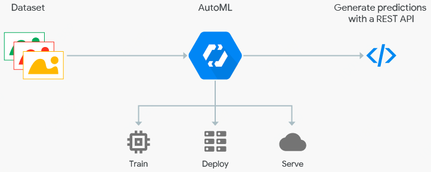

#### 核心原理

AutoML由控制器(Controller)和子网络(Child)两个神经网络组成，控制器生成子模型架构，子模型架构执行特定的任务训练并评估模型的优劣反馈给控制器，控制器将会将此结果作为下一个循环修改的参考。重复执行数千次“设计新架构、评估、回馈、学习”的循环后，控制器能设计出最准确的模型架构。

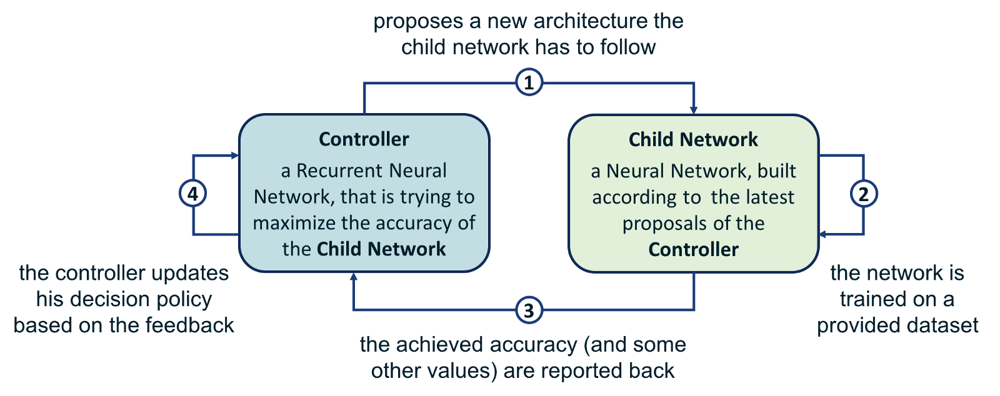

#### 技术基础

##### Transfer Learning 技术

谷歌通过迁移学习(Transfer Learning)将已训练完成的模型，转移到新的模型训练过程。这样，能够用较少量数据训练出机器学习模型。虽然只拥有很少的数据，但谷歌用友很多类似的AI模型，所以通过迁移学习，谷歌可以将这两者结合起来，生成一个满足需求的AI模型。

##### Learning2Learn 技术

自动挑选适合的模型

##### Hyperparameter tuning 技术

自动调整参数

##### Neural Architecture Search技术

AutoML用的是增强学习(迭代)+RNN生成的方法，实际上针对的是CNN的网络结构，用深度学习调参来训练确定网络构架。

### 亚马逊

https://docs.aws.amazon.com/sagemaker/latest/dg/automatic-model-tuning.html

### SIGOPT

https://sigopt.com/

### 阿里PAI AutoML Engine

PAI AutoLearning自动学习

### 华为 Model Arts

https://support.huaweicloud.com/exemlug-modelarts/modelarts_21_0001.html

#### 图像分类

识别一张图片中是否包含某种物体

#### 物体检测

识别出图片中每个物体的位置及类别

#### 预测分析

对结构化数据做出分类或数值预测

\##### 

数据预览，用户界面选择label和feature列，以及模型类型(分类、回归)，自动训练好模型，并输出在验证集上的模型评估结果。发布模型，部署上线。

### 声音分类

### [第四范式--先知AutoML](https://www.4paradigm.com/product/automl)

低门槛、自动化的决策类AI应用开发工具。

全流程自动化构建模型、应用模型，更新模型。无需机器学习专业技能，简单易用。多行业真实场景验证， 30个迭代内可达到或超越专家效果。

实现AI全闭环的自动运行

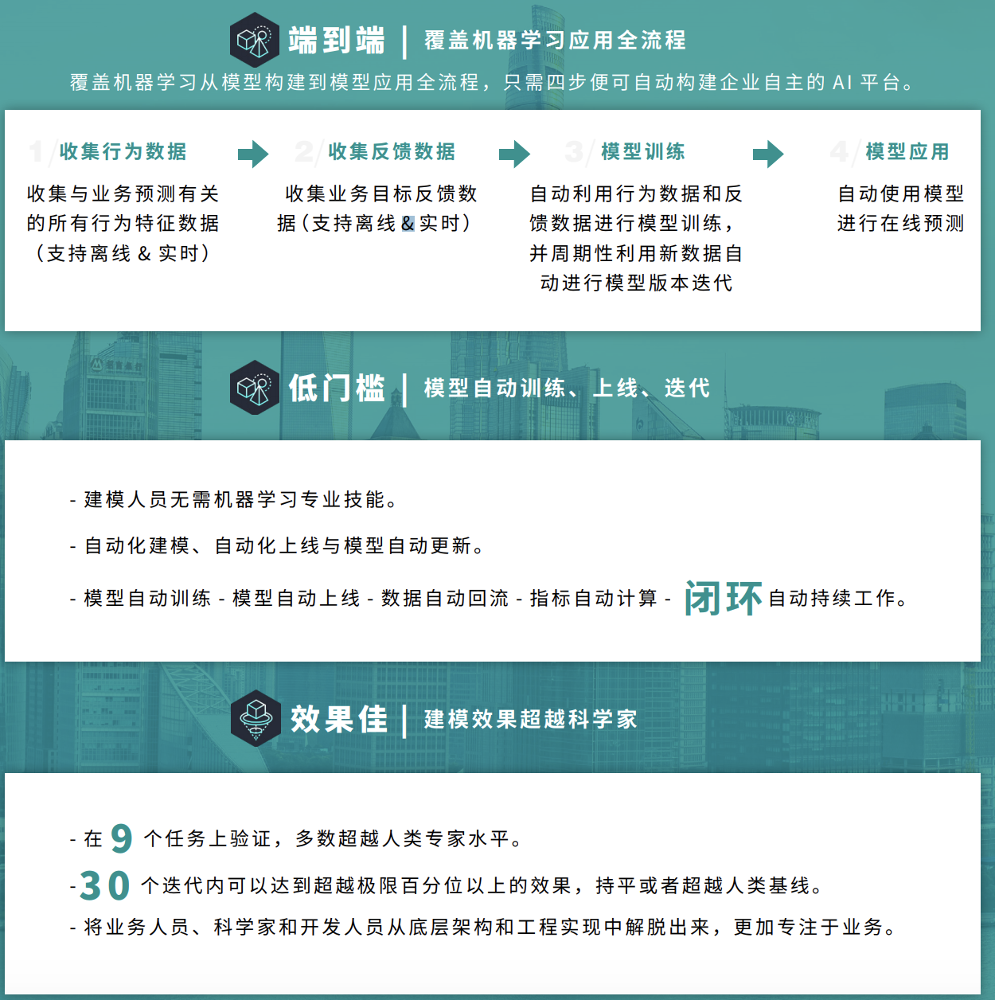

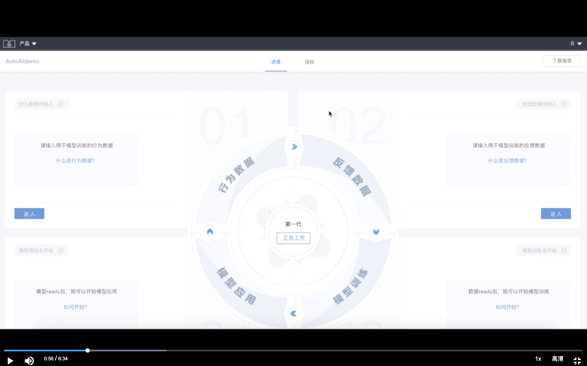

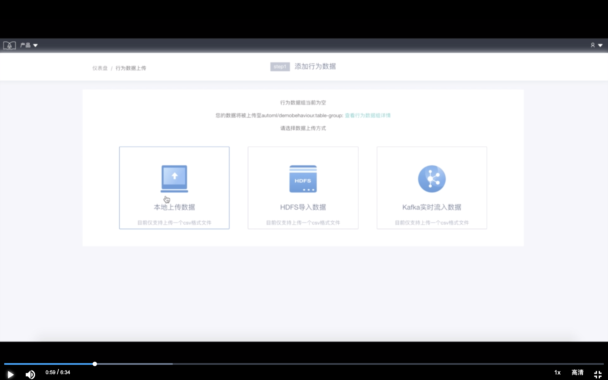

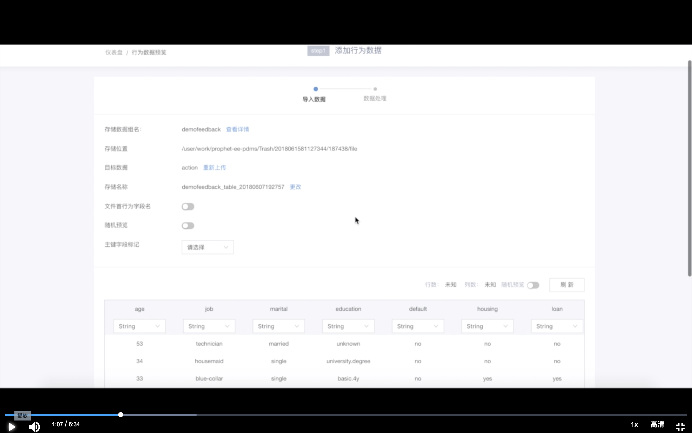

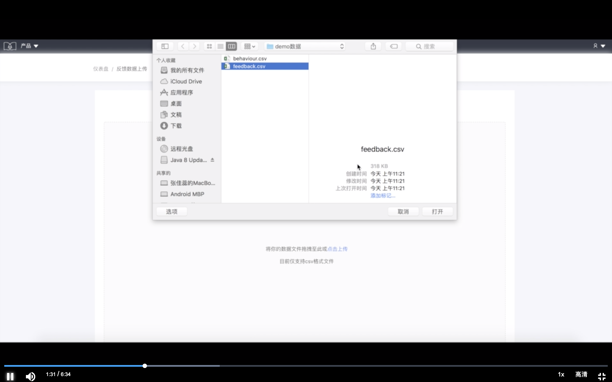

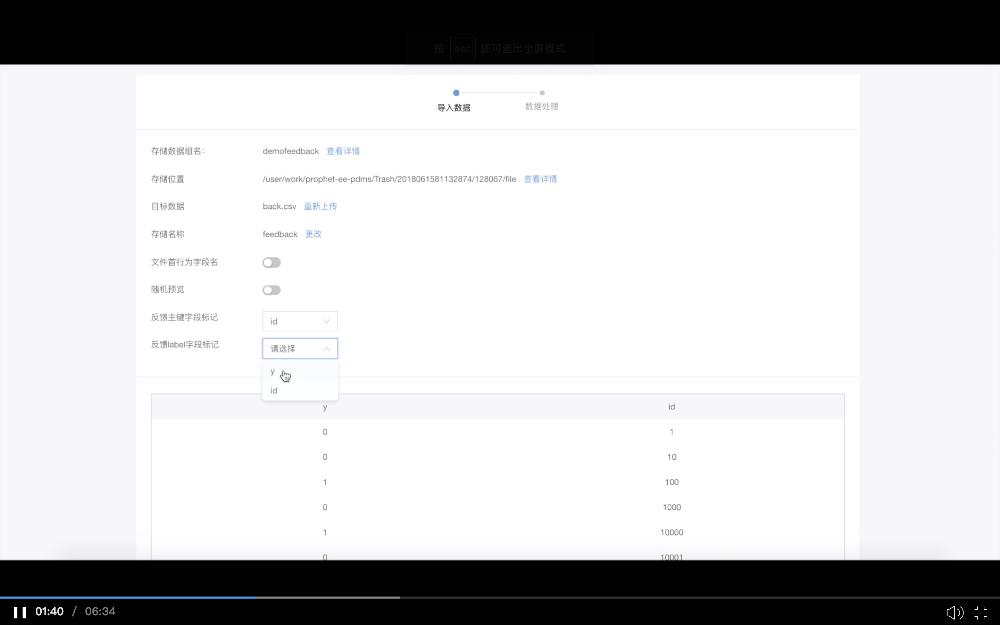

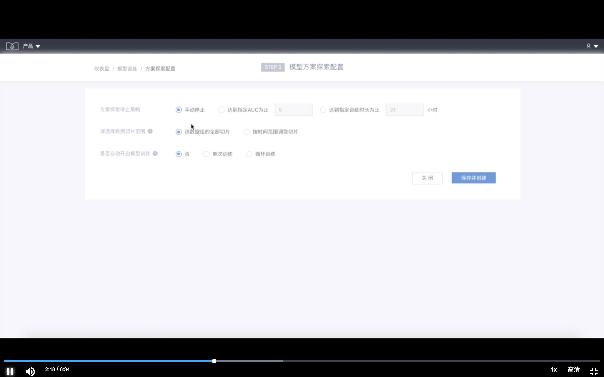

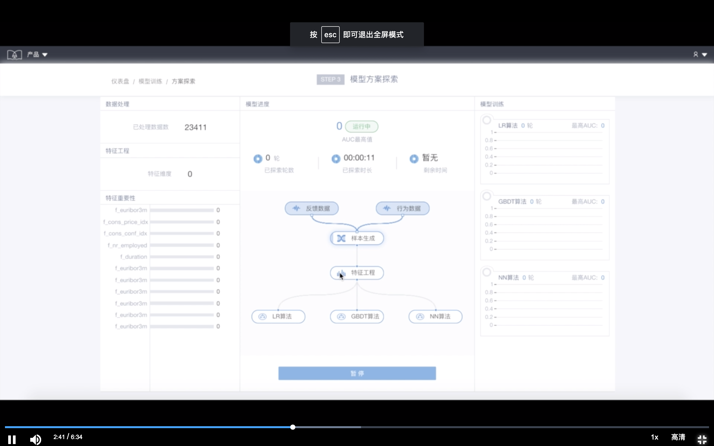

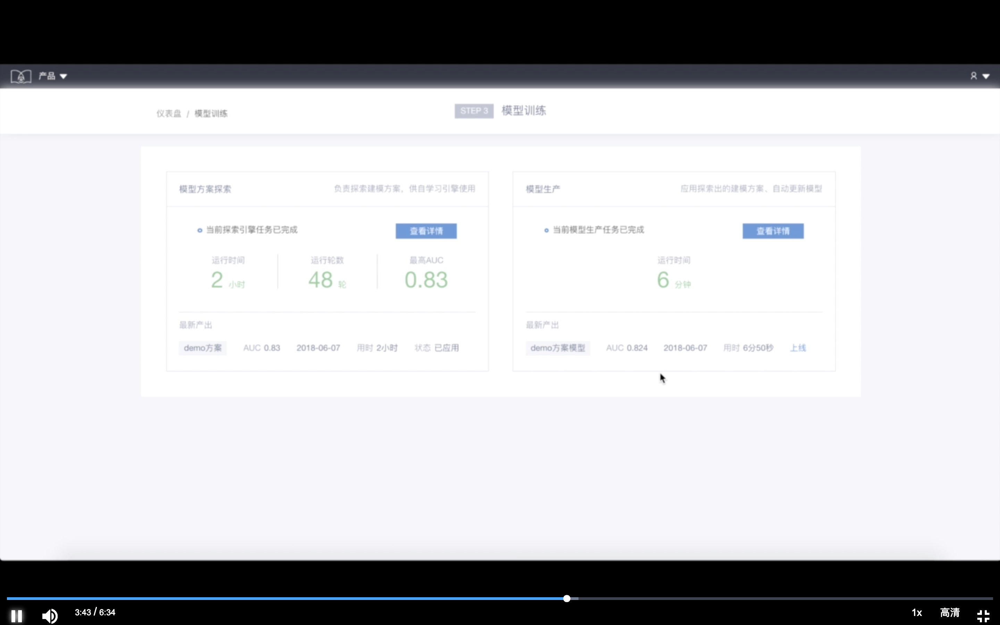

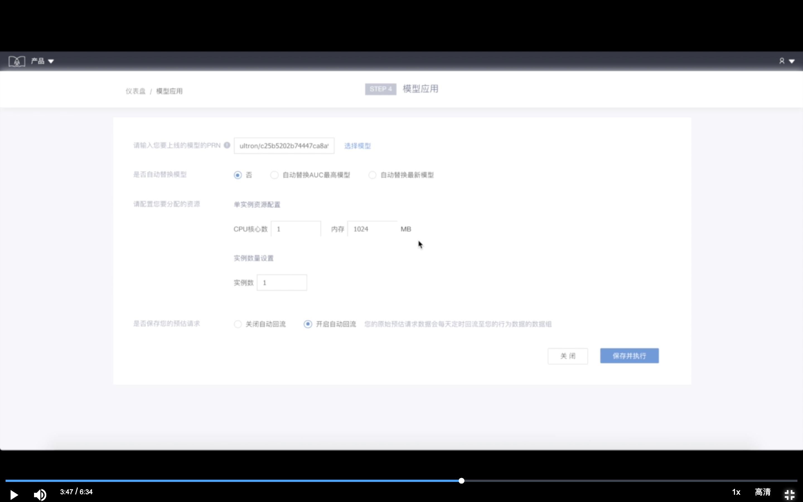

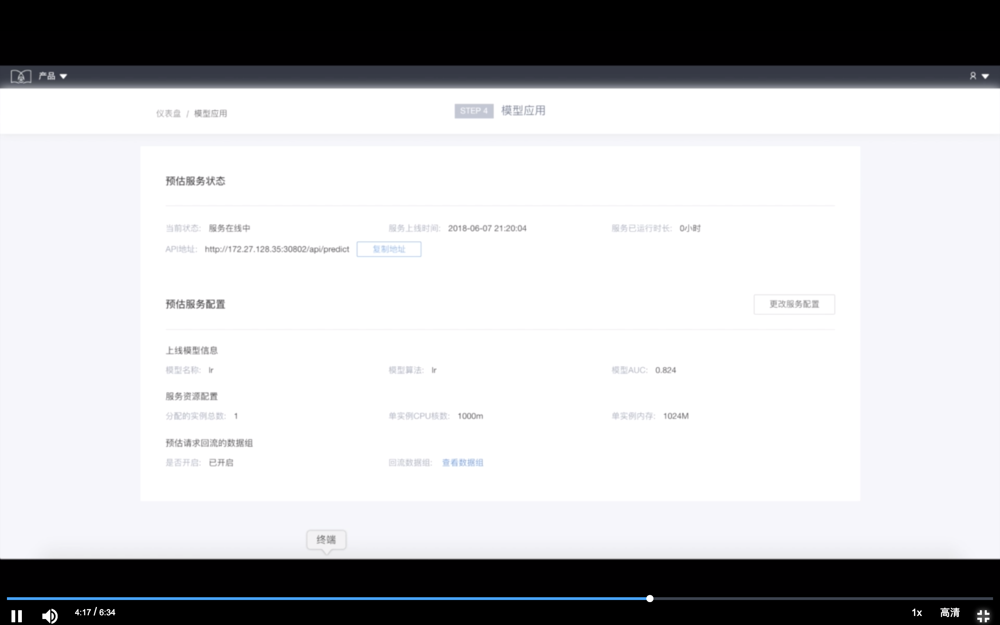

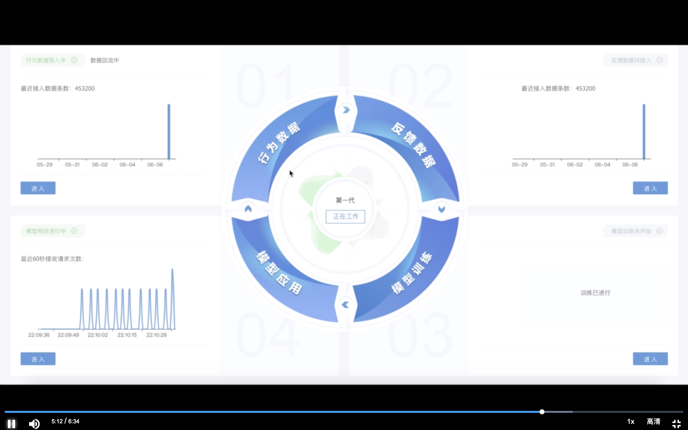

**服务监控运维**

服务监控运维中心以可视化指标形式，使服务可追踪、可运维。

指标中心提供包含业务反馈指标、模型指标、监控运维指标在内的指标体系，方便用户追踪监控业务效果，分析业务趋势。特有自定义指标计算，更加贴近客户业务。不仅如此，指标中心提供可视化的指标呈现形式，提升了指标查看与用户工作交流与汇报的效率。

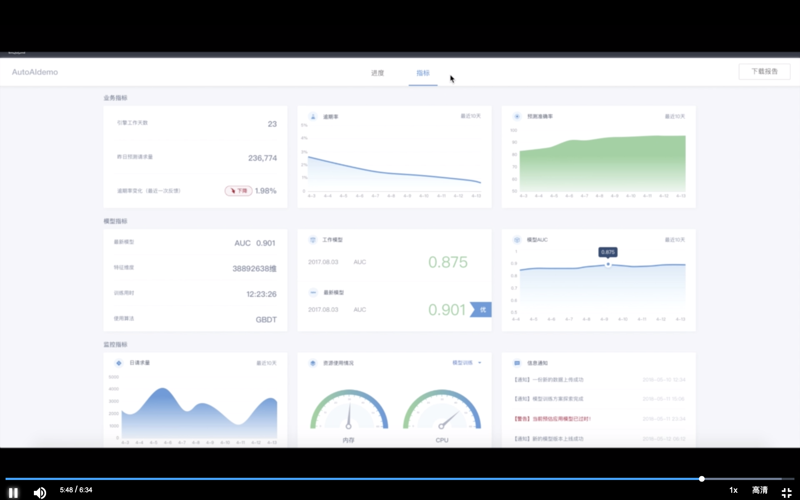

