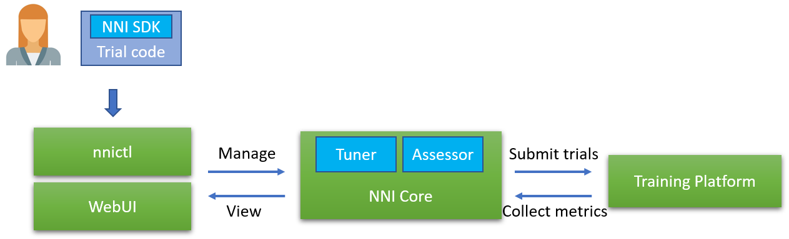

## 简介

NNI (Neural Network Intelligence) 是一个工具包，可有效的帮助用户设计并调优机器学习模型的神经网络架构，复杂系统的参数（如超参）等。 NNI 的特性包括：易于使用，可扩展，灵活，高效。

- **易于使用**：NNI 可通过 pip 安装。 只需要在代码中添加几行，就可以利用 NNI 来调优参数。 可使用命令行工具或 Web 界面来查看实验过程。
- **可扩展**：调优超参或网络结构通常需要大量的计算资源。NNI 在设计时就支持了多种不同的计算资源，如远程服务器组，训练平台（如：OpenPAI，Kubernetes），等等。 通过训练平台，可拥有同时运行数百个 Trial 的能力。
- **灵活**：除了内置的算法，NNI 中还可以轻松集成自定义的超参调优算法，神经网络架构搜索算法，提前终止算法等等。 还可以将 NNI 连接到更多的训练平台上，如云中的虚拟机集群，Kubernetes 服务等等。 此外，NNI 还可以连接到外部环境中的特殊应用和模型上。
- **高效**：NNI 在系统及算法级别上不停的优化。 例如：通过 Trial 早期的反馈来加速调优过程。

下图显示了 NNI 的体系结构。




## 主要概念

- *Experiment（实验）*：实验是一次找到模型的最佳超参组合，或最好的神经网络架构的任务。 它由 Trial 和自动机器学习算法所组成。
- *搜索空间*：是模型调优的范围。 例如，超参的取值范围。
- *Configuration（配置）*：配置是来自搜索空间的一个参数实例，每个超参都会有一个特定的值。
- *Trial*: Trial 是一次尝试，它会使用某组配置（例如，一组超参值，或者特定的神经网络架构）。 Trial 会基于提供的配置来运行。
- *Tuner*: Tuner 是一个自动机器学习算法，会为下一个 Trial 生成新的配置。 新的 Trial 会使用这组配置来运行。
- *Assessor*：Assessor 分析 Trial 的中间结果（例如，测试数据集上定期的精度），来确定 Trial 是否应该被提前终止。
- *训练平台*：是 Trial 的执行环境。 根据 Experiment 的配置，可以是本机，远程服务器组，或其它大规模训练平台（如，OpenPAI，Kubernetes）。

## NNI中的Tuner

https://github.com/microsoft/nni/blob/master/docs/en_US/Assessor/BuiltinAssessor.md#MedianStop

用来搜索参数空间的算法： TPE, Random, Anneal, Evolution, BatchTuner, MetisTuner, GPTuner，SMAC (SMAC should be installed through nnictl)

TPE
当你可以运行的Trial数很少时，适合使用TPE。据经验，TPE远比Random Search好。

Anneal
当每个Trail需要的时间很少的时候，可以使用Anneal，或者参数空间的变量服从某种已知分布。

Naive Evolution
（果然有遗传算法），这中算法开局需要有很多种子，这样才能尽量避免落入局部最优，所以每个Trail也不能太大。特别的，如果你的模型可以支持weight transfer（权重迁移），也就是一个模型的权重可以继承他的父亲（也就是搜索树呗），那么这个过程就可以大幅提速（估计有一些涉及深拷贝、浅拷贝的奇技淫巧）

SMAC
和TPE有一点相同，就是当你算力受限只能进行很少的trail的时候，可以使用。SMAC对离散的参数进行了优化，所以更加适合离散参数。和之前需要很多trail的算法比，我觉得SMAC和TPE因该是收敛速度更快一些，但是可能更鲁莽一些，陷入局部最优的可能性更大，毕竟如果算力允许，Trail肯定是越多越好。

Batch
不是算法，而是一个接口，如果你只想尝试某些组合（也就是说你已经人工YY出了一些好参数），那就放到Batch Tuner里面。

Hyperband
跟TPE、SMAC相似的就是还是适合少量Trail时使用，当训练的中间结果（比如Accuracy）可以反映好坏的时候，这种算法更好，应该是算法本身有一些拟合思想在其中。

Network Morphism
“网络多态”这显然不是一个算法，这就是帮你测试不同的网络架构，估计这个还是很耗算力的，目前只支持Computer Vision领域。

MetisTuner
和 TPE、SMAC一样，又是一个黑箱优化算法。也是适合单个Trail很长的情况。这是一个启发式搜索算法，只需要提供Accuracy即可。


## 运行过程

Experiment 的运行过程为：Tuner 接收搜索空间并生成配置。 这些配置将被提交到训练平台，如本机，远程服务器组或训练集群。 执行的性能结果会被返回给 Tuner。 然后，再生成并提交新的配置。

每次 Experiment 执行时，用户只需要定义搜索空间，改动几行代码，就能利用 NNI 内置的 Tuner/Assessor 和训练平台来搜索最好的超参组合以及神经网络结构。 基本上分为三步：

 第一步：[定义搜索空间](https://github.com/microsoft/nni/blob/master/docs/zh_CN/Tutorial/SearchSpaceSpec.md)

 以json格式文件定义模型参数的取值范围。

 第二步：[改动模型代码](https://github.com/microsoft/nni/blob/master/docs/zh_CN/TrialExample/Trials.md)

 - 通过NNI中的nni.get_next_parameter()方法自动从搜索空间中获取一组参数，更新当前参数

 - 用新的参数更新模型，在训练集上训练模型，在验证集上评估模型，通过NNI的nni.report_final_result(score)方法将评估结果报告给NNI。

 - 如此循环，直到满足终止条件。伪代码如下：

   ```sh
   input: search space, trial code, config file
   output: one optimal hyperparameter configuration
   
   1: For t = 0, 1, 2, ..., maxTrialNum,
   2:      hyperparameter = chose a set of parameter from search space
   3:      final result = run_trial_and_evaluate(hyperparameter)
   4:      report final result to NNI
   5:      If reach the upper limit time,
   6:          Stop the experiment
   7: return hyperparameter value with best final result
   ```


 第三步：[定义 Experiment 配置](https://github.com/microsoft/nni/blob/master/docs/zh_CN/Tutorial/ExperimentConfig.md)

以YAML格式文件定义试验的相关配置，包括：

- 试验名称
- 并行搜索试验的数量、最大试验数量
- 最大运行时间
- 训练平台的配置，如本机，远程服务器组或训练集群
- 第一步定义搜索空间的json文件的路径
- 超参数调优算法的配置
- 试验的启动命令
- GPU数量的配置
- 等等


### 如何使用搜索到的最优参数

方式一：在Web UI中复制出效果最优模型的参数组合

方式二：通过命令行工具导出参数组合【能直接导出训练好的最优模型吗？】

```
nnictl experiment export [experiment_id] --filename [file_path] --type json

nnictl experiment export sgwQJ --filename mnist_hpo.json --type json
```


## 快速入门

安装

```
python3 -m pip install --upgrade nni
```

验证安装

```sh
# 1. 下载源码
git clone -b v1.0 https://github.com/Microsoft/nni.git

# 2. 启动测试例子
nnictl create --config nni/examples/trials/mnist/config.yml

nnictl create --config nni/examples/trials/auto-gbdt/config.yml --port 8084

nnictl create --config nni/examples/trials/auto-xgb/config.yml --port 8082
# 3. 在浏览器中打开启动的Web UI
# 启动测试例子后，命令行会打印出提示信息：
# INFO: Successfully started experiment!
# -----------------------------------------------------------------------------------
# The experiment id is b85aA4iz
# The Web UI urls are: http://127.0.0.1:8080   http://10.13.113.31:8080

```


超参数调优

- 传统模型sklearn、xgb、lgb
- DNN（TF、Keras、Pytorch）

NAS

- 

