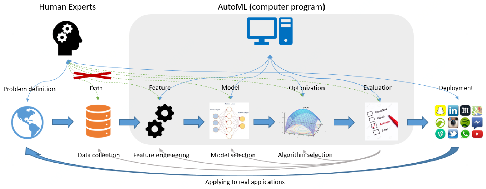

### AutoML概述

#### AutoM的提出背景

伴随着现代信息技术的快速发展，人类社会进入大数据时代，大数据正深刻改变着人类社会发展方向。大数据的核心是利用数据的价值，人工智能和机器学习是利用数据价值的关键技术。近年来，越来越多的企业、机构借助人工智能(Artificial Intelligence, AI)和机器学习(Machine Learning, ML)技术，从大数据中提炼商业见解，辅助商业决策，推动现代商业运营，解决了许多传统方法难以解决的问题，创造了巨大价值。

需要专业知识

周期长。

但目前成功的关键还需依赖人类机器学习工程师完成以下工作：

- 预处理数据
- 特征工程：包括特征提取、特征降维、特征选择、特征生成以及特征编码等
- 模型选择：包括算法选择、模型结构设计、超参数优化等
- 优化算法选择
- 模型评估

目前，世界上只有小部分企业拥有足够的人力财力资源充分发挥AI和机器学习的潜能，也只有小部分人有能力开发出先进的机器学习模型。但即使这样一小部分拥有AI专家的企业，也仍需大量时间且反复过程才能构建出自定义的机器学习系统。

自动机器学习(Automated Machine Learning, AutoML) 试图将这些与特征、模型、优化、评价有关的重要步骤进行自动化地学习，使得机器学习模型无需人工干预即可被应用。从而帮助企业创造以下收益：

- 缩短 AI 应用投产时间：降低建模所需人员规模和技能门槛，通过自动化技术将 AI 应用构建时间缩短至数天
- 降低 AI 应用建设成本：通过标准化建模过程实现企业 AI 应用规模化发展，大幅削减企业拥有 AI 能力的总成本。
- 适应业务快速变化：利用高性能 AI 开发工具实现模型的快速迭代，灵活适应业务变化。

AotoML如何最小化机器学习pipeline中人工干预 (Quanming Yao et al, 2018)

## AutoML简史

参考[^2]

#### AutoML的定义

自动机器学习(Automated Machine Learning, AutoML)是一个将机器学习这个用于解决现实世界问题的端到端的处理过程进行自动化的过程[^1]。

从名字来看，AutoML是自动化与机器学习的交叉。

1. 从机器学习角度讲，AutoML 可以看作是一个在给定数据和任务上学习泛化能力非常强大的系统。但是它强调必须非常容易使用；

2. 从自动化角度讲，AutoML 则可以看作是设计一系列高级的控制系统去操作机器学习模型，使得模型可以自动化地学习到合适的参数和配置而无需人工干预。 

从上述定义可以看出，AutoML不仅期望学习的模型具有良好的学习性能，而且要求自动化地学习到合适的参数和配置而无需人工干预。一个通用的 AutoML 定义如下：
$$
\begin{equation}
\max_{configurations}\text{performance of learning tools,} \\
s.t. \begin{cases}
\text {no human assistance} \\
\text {limited computational budget}
\end{cases}
\end{equation}
$$
即在无人工干预和有限计算资源预算的约束下，学习到一组能够最大化模型性能的模型参数配置(configurations)。这里，**模型参数配置(configurations)指影响模型性能的几乎所有的因素，比如：模型的假设类型，模型利用的特征，控制模型训练过程的超参数，网络架构等**。

#### AutoML的核心任务

- 更好地性能：在不同的输入数据和学习任务上有良好的泛化能力
- 无需人工干预
- 更低的计算开销

#### AutoML的主要目标

AutoML的主要目标在于对机器学习过程的不同阶段进行自动化。

1. 自动化的数据预处理
   - 自动化的列数据类型检测，例如：boolean、离散数值型、连续数值型、文本型等；
   - 自动化的列意图检测，例如：target/label、分层字段、数值型特征、类别文本特征、自由文本特征等；
   - 自动化的任务检测，例如：二分类、回归、聚类、排序等。
2. 自动化的特征工程
   - 特征选择
   - 特征提取
   - 元学习和迁移学习
   - 倾斜数据或缺失值的检测和处理
3. 自动化的模型选择
4. 学习算法和特征化的超参数优化
5. 在时间、内存和复杂度的限制下，自动化的学习管道(pipeline)选择
6. 自动化的选择模型评估度量和验证流程
7. 自动化的问题检查
   - 泄漏检测
   - 误配置检测
8. 自动化的结果分析
9. 用户自动化机器学习的用户界面和可视化

#### AutoM的研究动机

#### AutoML的意义和作用

### AutoML的研究领域

AutoML, AutoDL

#### 按pipeline环节划分

##### AutoClean

##### AutoFE

##### AutoAugment

##### AutoNAS

##### HPO

##### Auto部署预测

##### Auto运维

##### AutoML Pipeline

从数据理解到模型部署整个机器学习全流程(pipeline)所有步骤的自动化。

#### 按应用领域划分

##### 传统机器学习

**AutoWSL**

##### AutoST

##### AutoCV

图像分类

目标检测

语义分割

##### AutoVoice

##### AutoNLP

##### AutoGraph

##### AutoGAN