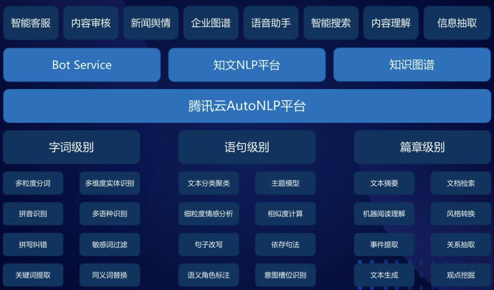
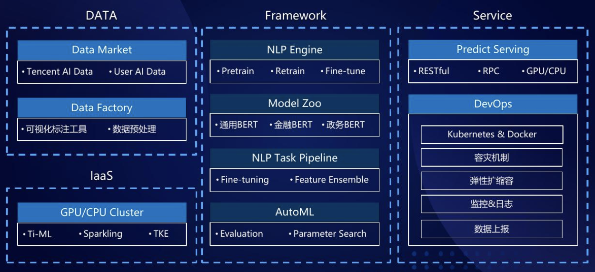

#### AutoNLP需要解决的问题

- 如何对不同语言的文本数据进行自动化预处理？
- 如何自动化处理长文本和短文本？
- 如何从文本数据中自动提取有用的特征？
- 如何自动设计有效的神经网络结构？
- 如何构建和自动选择有效的预训练模型？
- 如何自动高效地选择合适机器学习模型及其超参数？
- 如何使自动搜索到的模型更具有普适性，例如使其应用于未见过的任务？
- 如何降低计算开销和内存开销使其在可接受范围内？


### 研究进展

#### TextNAS

文本表征向量学习对于文本分类和其它语言相关的任务至关重要。目前已有各种各样的文本表征网络模型，如何从中选择最优的呢？

搜索空间的设计依赖于人类先验知识，对于NAS在不同任务上的成功应用十分重要。

针对文本表征，提出了一个经过裁剪的新颖搜索空间。

TextNAS的搜索空间包涵：

```
* 1-D convolutional operator with filter size 1, 3, 5, 7 
* recurrent operator (bi-directional GRU) 
* self-attention operator
* pooling operator (max/average)
```

类似ENAS算法，TextNAS使用了参数共享以加快搜索速度，同时采用了强化学习进行神经网络架构的采样和生成。

> ==ENAS中参数共享是如何设计的？如何使用强化学习的？==
>
> ==TextNAS方法如何与实际工作中的任务结合？==


### to find improved recurrent neural networks (RNNs

Zoph & Le, 2017; Pham et al., 2018

- Zoph, B. and Le, Q. V. Neural architecture search with reinforcement learning. In International Conference on Learning Representations, 2017.
- Pham, H., Guan, M. Y., Zoph, B., Le, Q. V., and Dean, J. Efficient neural architecture search via parameter sharing. In International Conference on Machine Learning, 2018.

### Evolved Transformer

运用NAS技术搜索一个比Transformer更优的架构。

- 进化算法
- Progres- sive Dynamic Hurdles method, which allows us to dynamically allocate more resources to more promising candidate models.
- warm starting by seeding our initial population with the Transformer


==Auto-keras的文本分类和文本回归实现了什么的自动化？如何实现的？==

### 业界实践

腾讯云AI语义产品矩阵



腾讯云AutoNLP元素架构图

