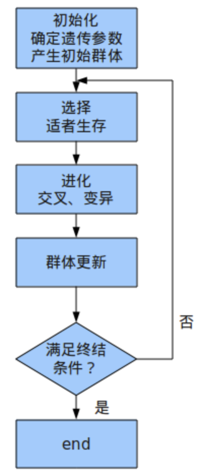
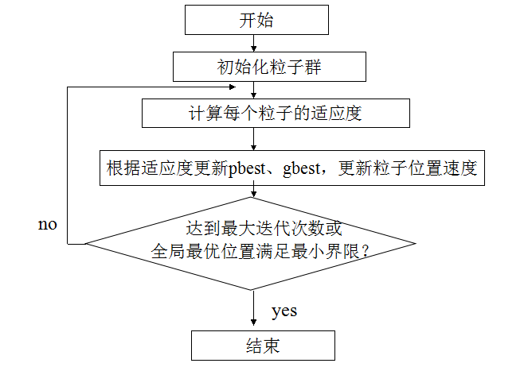
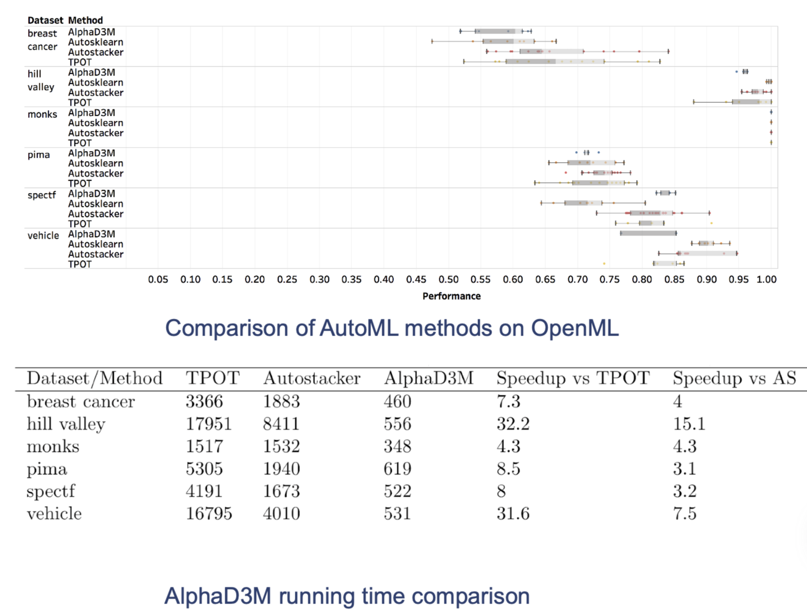
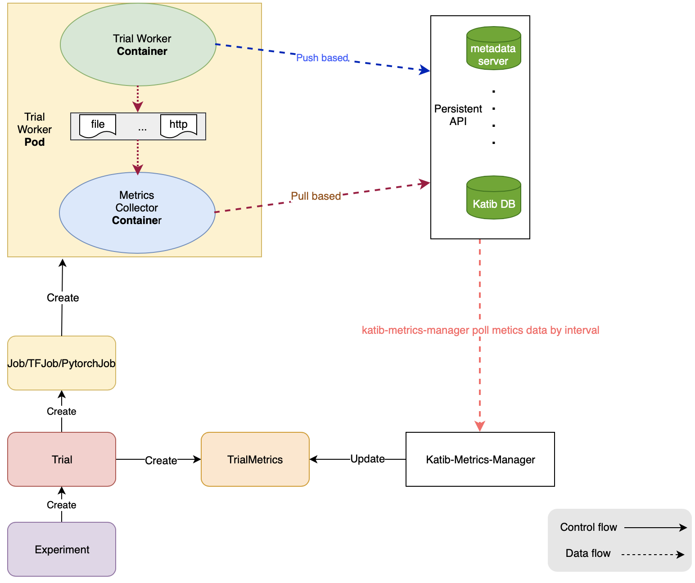

## AutoML技术原理与产品化思路

自动机器学习(AutoML)技术是当前机器学习领域热点研究和迅速发展的方向之一，已被证明能够在多个领域达到或超过人类专家手动调参的效果，国内外许多头部公司纷纷将AutoML技术集成到自研AI平台中，降低算法工程师调参试错成本，加速机器学习模型的构建和落地。本次分享将介绍AutoML的定义、目标和研究领域，梳理、回顾自动化机器学习管道创建和超参数调优算法，并对主流AutoML开源框架进行对比分析，然后讨论AutoML产品化的思路。

AutoML的定义

AutoML的核心任务与目标

AutoML的研究领域

AutoML问题形式化

自动化机器学习管道创建方法回顾

自动化超参数调优算法回顾

AutoML开源框架对比分析

真实案例自动调参实践

AutoML产品化思路

[TOC]

自动超参数优化是什么

自动超参数优化的意义

自动超参数优化的原理

开源产品对比

在KuAI平台的初步集成现状

- 自定义镜像
- Demo

两个应用案例

- xgb
- DNN

产品化思路

- 一键式模型自动调参、模型仓库 --> 模型部署
- 半自动化
  - 生产最优超参数和模型文件
  - 基于超参数在大规模数据上训练
  - 在部分automl不够成熟的领域作为baseline

下一步计划

- 性能优化（搜索算法优化、分布式训练kubeflow集成）
- 产品化
- AutoPipeline
- NAS

### 什么是AutoML？

#### AutoML定义

自动机器学习(Automated Machine Learning, AutoML)是一个将==机器学习==这个用于解决现实世界问题的端到端的==处理过程==进行==自动化==的过程[^1]。

AutoML是自动化与机器学习的交叉。

- 从机器学习角度讲，AutoML 可以看作是一个在给定数据和任务上学习**泛化能力非常强大**的系统。
- 从自动化角度讲，AutoML 则可以看作是设计一系列**高级的控制系统**去操作机器学习模型，使得模型可以自动化地学习到合适的参数和配置而**无需人工干预**。 

一个通用的 AutoML 定义如下：
$$
\begin{equation}
\max_{configurations}\text{performance of learning tools,} \\
s.t. \begin{cases}
\text {no human assistance} \\
\text {limited computational budget}
\end{cases}
\end{equation}
$$
即在无人工干预和有限计算资源预算的约束下，学习到一组能够最大化模型性能的模型参数配置(configurations)。

#### 直观认识AutoML

- NAS


- 对结构化数据做出分类或数值预测

  用户界面选择label和feature列，以及模型类型(分类、回归)，自动训练好模型，并输出在验证集上的模型评估结果。发布模型，部署上线。

  **结构化数据分类或数值预测**


### 为什么需要AutoML？

1. 因为依赖人类机器学习工程师完成以下工作，需要专业知识，探索、研究、开发周期长

- 预处理数据
- 特征工程：包括特征提取、特征降维、特征选择、特征生成以及特征编码等
- 模型选择：包括算法选择、模型结构设计、超参数优化等
- 优化算法选择
- 模型评估


**而现实需求是**：

- 缩短 AI 应用投产时间：降低建模所需人员规模和技能门槛，通过自动化技术将 AI 应用构建时间缩短至数天
- 降低 AI 应用建设成本：通过标准化建模过程实现企业AI应用规模化发展，大幅削减企业拥有 AI 能力总成本
- 适应业务快速变化：利用高性能 AI 开发工具实现模型的快速迭代，灵活适应业务变化

### AutoML解决哪些问题？


#### AutoML的核心任务

- 更好地性能：在不同的输入数据和学习任务上有良好的泛化能力
- 无需人工干预
- 更低的计算开销


#### 期望实现的目标

当前：

$Solution = ML Expertise + Data + Computing Power$

未来：

$Solution = Data + Computing Power * 100$

### AutoML的研究领域

#### 按学习方法分类

- AutoML
- AutoDL

#### 按机器学习Pipeline的阶段划分

AutoML的主要目标在于对机器学习过程的不同阶段进行自动化。

1. 自动化的数据预处理
   - 自动化的列数据类型检测，例如：boolean、离散数值型、连续数值型、文本型等；
   - 自动化的列意图检测，例如：target/label、分层字段、数值型特征、类别文本特征、自由文本特征等；
   - 自动化的任务检测，例如：二分类、回归、聚类、排序等。
2. 自动化的特征工程
   - 特征选择
   - 特征提取
   - 元学习和迁移学习
   - 倾斜数据或缺失值的检测和处理
3. 自动化的模型选择
4. 学习算法和特征化的超参数优化
5. 在时间、内存和复杂度的限制下，自动化的学习管道(pipeline)选择
6. 自动化的选择模型评估度量和验证流程
7. 自动化的问题检查
   - 泄漏检测
   - 误配置检测
8. 自动化的结果分析
9. 用户自动化机器学习的用户界面和可视化

#### 按应用场景划分


### AutoML问题形式化

#### 几个基本定义

典型监督学习模型Pipeline


一个机器学习管道(Machine Learning Pipeline)是不同算法的顺序组合，它将特征向量$\vec{x} \in \mathbb{X}^{d}$ 转换成目标值$y \in \mathbb{Y}$，如分类问题中的类别标签。

算法大致可以分为三类：数据清洗类算法、特征工程类算法、模型类算法。
$$
A_{cleaning} = \{A^{(1)}_{cleaning}, . . . , A^{(C)}_{cleaning}\} \\

A_{feature} = \{A^{(1)}_{feature}, . . . , A^{(F)}_{feature}\} \\

A_{model} = \{A^{(1)}_{model}, . . . , A^{(M)}_{model}\}
$$
所有算法的集合表示为：$\mathcal{A} = \{A_{cleaning} \cup A_{feature} \cup A_{model}\}$，其中每个算法$A^{(i)}$ 具有各自的超参数向量$\vec{\lambda}^{(i)} \in \Lambda^{(i)}$。


**定义1：机器学习管道(Machine Learning Pipeline)**

*设机器学习管道的结构$g \in G$为任意有向无环图(DAG)。图中每个结点(node)代表一个算法，图中每条边(edge)代表输入数据集在不同算法之间的数据流。一个机器学习管道可以表示为一个三元组$(g,\vec{A},\vec{\lambda})$，其中$\vec{A} \in \Lambda$ 为每个节点所选择算法组成的向量，$\vec{\lambda}$为每个算法对应的超参数向量。该管道表示为：$\mathcal{P}_{g, \vec{A}, \vec{\lambda}}$*


三元组$(g,\vec{A},\vec{\lambda})$称作一个配置。对于一个 $\mathcal{P}_{g, \vec{A}, \vec{\lambda}}$，需要评估其在给定数据集上的性能以确保构建的机器学习管道(ML Pipeline)具有低的泛化误差。

**定义2：管道性能(Pipeline Performance)**

*对于一个机器学习管道 $\mathcal{P}_{g, \vec{A}, \vec{\lambda}}$， $\vec{x_i}$表示特征向量，$y_i \in \mathbb{Y}$表示对应的目标值，$i = 1,...,n$。给定数据集 $D=\left\{\left(\vec{x}_{1}, y_{1}\right), \ldots,\left(\vec{x}_{n}, y_{n}\right)\right\}$ 和损失度量函数 $\mathcal{L}(\cdot, \cdot)$，  $\mathcal{P}_{g, \vec{A}, \vec{\lambda}}$ 的性能 $\pi$ 通过下式计算：*
$$
\pi=\frac{1}{n} \sum_{i=1}^{n} \mathcal{L}\left(\hat{y}_{i}, y_{i}\right)
$$
*式中，$\hat{y}_{i}=\mathcal{P}_{g, \vec{A}, \vec{\lambda}}\left(\vec{x}_{i}\right)$为管道 $\mathcal{P}_{g, \vec{A}, \vec{\lambda}}$ 对于给定样本 $\vec{x_i}$ 的预测输出。*

**注：该定义仅限于监督学习，非监督和强化学习可通过选择适当的损失函数参照以上方式进行扩展。**


**定义3：管道创建(Pipeline creation Problem)**

*给定算法集合 $\mathcal{A}$ 及其对应的超参数域 $\Lambda^{(\cdot)}$ 。将训练数据集 $D_{train} = \left\{\left(\vec{x}_{1}, y_{1}\right), \ldots,\left(\vec{x}_{n}, y_{n}\right)\right\}$ 参照k-折交叉验证的方式划分为  $\left\{D_{\text {valid}}^{(1)}, \ldots, D_{\text {valid}}^{(K)}\right\}$ 和 $\left\{D_{\text {train}}^{(1)}, \ldots, D_{\text {train}}^{(K)}\right\}$，其中$D_{t r a i n}^{(i)}=D_{t r a i n} \backslash D_{v a l i d}^{(i)}$。机器学习管道创建是指寻找一个管道结构以及构成管道的算法和算法的超参数组合，使得损失最小化*
$$
g^{\star}, \vec{A}^{\star}, \vec{\lambda}^{\star} \in \underset{g \in G, \vec{A} \in \mathcal{A}^{+}, \vec{\lambda} \in \Lambda}{\arg \min } \frac{1}{K} \sum_{i=1}^{K} \mathcal{L}\left(\mathcal{P}_{g, \vec{A}, \vec{\lambda}}\left(D_{t r a i n}^{(i)}\right), D_{v a l i d}^{(i)}\right)
$$
*式中 $\mathcal{L}\left(\mathcal{P}_{g, \vec{A}, \vec{\lambda}}\left(D_{t r a i n}\right), D_{v a l i d}\right)$ 表示在训练集 $D_{train}$ 上创建的管道 $\mathcal{P}_{g, \vec{A}, \vec{\lambda}}$ 在验证集 $D_{valid}$上进行评估的损失值。*


给定机器学习任务的数据集、损失函数和具体的任务类型(如分类、回归)，针对具体机器学习任务，机器学习管道的构建问题可以划分为以下三个子任务：

- 如何确定管道的结构，即DAG的形状？需要选择多少个数据清洗类、特征工程类和模型类算法？算法之间如何连接？数据如何流转？
- 每一个结点选择哪个具体的算法？
- 对于每个所选的算法，如何选择其超参数？


<center>机器学习管道创建问题的子问题<center/>


==是一个“黑盒优化”(black box optimization)问题。由于依赖于具体数据和任务，通常不可能预测损失函数的任何性质，甚至无法将其表达为封闭形式的表达式。因此，无法使用凸优化或基于梯度的优化等求解方式。==

#### AutoML框架的基本组成

- 搜索空间

  搜索空间定义了原则上可以选择的超参数的范围。 结合具体任务的先验知识可以减小搜索空间并简化搜索。 但是，这也引入了人为偏见，这可能会阻止寻找超越当前SOTA效果的新颖超参数组合。

- 搜索策略

  搜索策略定义了如何探索搜索空间，使用怎样的算法可以快速、准确找到最优的超参数配置。它包含了经典的探索 - 利用权衡(exploration-exploitation trade-off)。因为，一方面，需要快速找到性能良好的超参数配置，另一方面，应避免过早收敛到次优区域。

- 性能评估策略

  超参数优化的目标是为了找到能够在待预测的新数据上实现高预测性能的超参数配置。性能评估最简单的选择是在数据集上进行标准的模型训练和模型验证，但计算成本很高，并且限制了可以探索的超参数组合的数量。 因此，最近的许多研究都集中在开发降低这些性能评估成本的方法上。


### CASH算法

#### CASH定义

combined algorithm selection and hyperparameter optimization。

*给定pipeline的结构$g$、损失函数$\mathcal L$、训练数据集$D_{train}$和测试数据集$D_{valid}$，为$g$中每个节点(node)选择合适的算法及其超参数，使得该pipeline在验证集上的损失值最小化。*
$$
A^{\star}, \vec{\lambda}^{\star} \in \arg \min_{A^{(j)} \in \mathcal{A}, \vec{\lambda} \in \Lambda^{(j)}} \mathcal{L}\left(A_{\vec{\lambda}}^{(j)}\left(D_{\text {train }}\right), D_{\text {valid }}\right)
$$
*损失函数$\mathcal L$不平滑，不可导。*

scikit-learn中实现了30种分类算法，总共超过250个超参数。

**配置空间**
$$
\Lambda=\Lambda^{(1)} \times \ldots \Lambda^{(n)} \times \lambda_{r}
$$


**目标函数**
$$
\vec{\lambda}^{\star} \in \underset{\vec{\lambda} \in \Lambda}{\arg \min } \mathcal{L}\left(A_{\vec{\lambda}}\left(D_{\mathrm{train}}\right), D_{\mathrm{valid}}\right)
$$


超参数的类型：

- 类别型
- 整数型
- 实数型
- 条件型

可配置空间表达为树状结构，减少搜索空间。


#### CASH算法思维导图

- **Grid Search & Contradicting Grid Search**
- **Random Search**
- **SMBO(Sequential Model-Based Optimization)**
  - Gaussian Process
  - Random Forest
  - TPE
- **Evolutionary Algorithms**
  - Genetic Programming
  - Particle Swarm Optimization
- - 遗传编程
  - 粒子群优化
- **Multi-Armed Bandit Learning**
- **Gradient Descent**

#### Grid Search

需将连续超参数离散化，构成的搜索空间为n个离散化的超参的笛卡尔积空间：
$$
\Lambda_{G S}=\lambda_{1: k}^{(1)} \times \lambda_{1: k}^{(2)} \times \cdots \times \lambda_{1: k}^{(n)}
$$
**优点：**易实现，易并行。

**缺点：**在高维空间容易遇到维度灾难；没有考虑层次超参数结构，存在冗余超参配置；没有利用以探索的表现较好超参的配置。

#### Contradicting Grid Search

首先在粗粒度网格进行搜索，然后在表现最好的配置点上进行细粒度的搜索。

#### Random Search

优点：易实现，易并行；适合于具有多个局部极小值、不可导函数的求解；较网格搜索快。

缺点：没有利用以探索的表现较好超参的配置。

**Grid Search 与 Random Search对比**

对于网格搜索，9次试验仅测试了3个不同的位置，而对于随机搜索则测试了9个不同的位置。


例如，Branin函数
$$
f(\vec{x})=\left(x_{2}-\frac{5.1 x_{1}}{4 \pi^{2}}+\frac{5 x_{1}}{\pi}-6\right)^{2}+10\left(1-\frac{1}{8 \pi}\right) \cos \left(x_{1}\right)+10
$$


<center>Branin函数的响应曲面<center/>


具有多个局部极小值和较大的绝对梯度方差，在$\vec{x}^{*}=(-\pi, 12.275),(\pi, 2.275) \text { 和 }(9.42478,2.475)$三处取得全局最小值$f\left(\vec{x}^{*}\right)=0.397887$。


<center>寻找Branin函数最小值的不同搜索策略的示意图<center/>


#### Sequential Model-Based Optimization

SMBO，基于模型的序列优化方法框架，包含三个核心部分：

- 代理模型的选择：选择使用Gaussian Process, Random Forest, or TPE等方法捕获超参数组合与模型性能之间的关系，构建概率模型$p(y|x)$，模拟模型训练的结果，对目标函数进行预估评价。
- 代理模型的更新：迭代式地采用贝叶斯方法对代理函数进行优化，即基于新的观测更新代理模型进而增强代理模型能力，使其超参数组合的选择越来越靠谱有效。
- 基于后验分布下新的超参组合的选取。基于获益函数(Acquisition Function)计算超参组合的优劣程度，从中挑选出k个组合进行下一轮迭代。**注意探索和利用的权衡。**

**序列迭代过程**：


**算法：**

- 第3步选择什么样的代理模型呢？
- 第4步如何选择超参数组合呢？


##### 获益函数(Acquisition Function)

基于PI、EI、UCB等方法定义的用来计算超参组合优劣程度的函数叫做获益函数，它根据某种标准描述了选择某个超参组合会带来改善的程度。

- PI (Probability Improvement， 概率提升法)
- EI (Expected Improvement，期望提升法)
- UCB (Upper Confidence Bound，上置信区间)

##### 基于高斯过程回归的序列超参优化

##### 基于随机森林算法的序列超参优化

##### 基于TPE算法的序列超参优化

#### Evolutionary Algorithms

##### Genetic Programming

遗传算法是受大自然的启发，模拟生物在自然环境中的遗传和进化过程而形成的一种自适应、具有全局优化能力的随机搜索算法。自然界的进化包括3个原则

遗传算法的思路：通过从给定一个初始群体出发，利用选择算子、杂交算子以及变异算子来模拟自然进化，逐步改进种群，一步步逼近最优解，以达到求解最优化问题的目的。

初始化一群解，然后再在这些解中选择较优的一部分，将选择的这一部分解进行交叉，且以一定概率变异，（交叉一般能得到比当前解更好的解，而变异则很可能让结果变差，所以变异的概率一般不是很大，但是这样有助于我们跳出局部最优）。交叉变异以后进行群体更新。

每个个体代表具有相应超参数的算法。需将连续超参数离散化。

删除：剔除某个超参数用默认值来代替；

插入：将某个未配置的超参数用某个值来代替；

变异：改变某个超参数的值；

交叉：选择两个个体的超参数子集进行合并。

**优点：**同一种群个体之间独立，易并行处理。

**缺点：**相比于贝叶斯优化不够高效，不太适合于算法选择，因为两个算法很难交叉。




##### Particle Swarm Optimization

类别型和整数型超参数需要转换为连续变量。

粒子群算法的思想源于对鸟/鱼群捕食行为的研究，模拟鸟集群飞行觅食的行为，鸟之间通过集体的协作使群体达到最优目的。它没有遗传算法的“交叉”(Crossover) 和“变异”(Mutation) 操作，通过追随当前搜索到的最优值来寻找全局最优。

- **算法介绍**

每个寻优的问题解都被想像成一只鸟，称为“粒子”。所有粒子都在一个D维空间进行搜索。

所有的粒子都由一个fitness function 确定适应值以判断目前的位置好坏。

每一个粒子必须赋予记忆功能，能记住所搜寻到的最佳位置。

每一个粒子还有一个速度以决定飞行的距离和方向。这个速度根据它本身的飞行经验以及同伴的飞行经验进行动态调整。


$D$维空间中，有$N$个粒子：

粒子 $i$ 的位置：$\mathbf{x}_{i}=\left(\mathrm{x}_{i 1}, \mathrm{x}_{i 2}, \ldots \mathrm{x}_{i D}\right)$，将$\mathbf x_i$代入适应函数 $f(x_i)$ 求适应值

粒子 $i$ 的速度：$\mathbf{v}_{i}=\left(\mathrm{v}_{i 1}, \mathrm{v}_{i 2}, \ldots \mathrm{v}_{i D}\right)$

粒子 $i$ 个体经历过的最好位置：$\mathbf {pbest_i} = \left(\mathrm{p}_{i 1}, \mathrm{p}_{i 2}, \ldots \mathrm{p}_{i D}\right)$

种群所经历过的最好位置：$\mathbf {gbest_i} = \left(\mathrm{g}_{1}, \mathrm{g}_{2}, \ldots \mathrm{g}_{D}\right)$

通常，在第 $d (1 \leqslant \mathrm{d} \leqslant \mathrm{D})$ 维的位置变化范围限定在 $\left[\mathrm{X}_{\min , d}, X_{\max , d}\right]$ 内，速度变化范围限定在 $\left[-V_{\max , d}, V_{\max , d}\right]$ 内 (即在迭代中，$\mathrm V_{id} $、$\mathrm X_{id}$若超出了边界值，则该维的速度或位置被限制为该维最大速度或边界位置)


- [ ] 粒子 $i$ 的第$d$维速度更新公式：
  $$
  \mathrm{v}_{\mathrm{id}}^{\mathrm{k}}=\mathrm{w} \mathrm{v}_{\mathrm{id}}^{\mathrm{k}-1}+c_{1} r_{1}\left(p b e s t_{i d}-x_{i d}^{k-1}\right)+c_{2} r_{2}\left(g b e s t_{d}-x_{i d}^{k-1}\right)
  $$

- [ ] 粒子$i$的第$d$维位置更新公式：
  $$
  x_{i d}^{k}=x_{i d}^{k-1}+v_{i d}^{k-1}
  $$
  $v_{id}^{k}$ ：第$k$次迭代粒子$i$飞行速度矢量的第$d$维分量

  $x_{id}^{k}$ ：第$k$次迭代粒子i位置矢量的第$d$维分量

  $c_1, c_2$ ：加速度常数，调节学习最大步长

  $r_1,r_2$ ：两个随机函数，取值范围$[0,1]$，以增加搜索随机性

  $w$ ：惯性权重，非负数，调节对解空间的搜索范围

  

　粒子速度更新公式包含三部分： 第一部分为“惯性部分”，即对粒子先前速度的记忆；第二部分为“自我认知”部分，可理解为粒子i当前位置与自己最好位置之间的距离；第三部分为“社会经验”部分，表示粒子间的信息共享与合作，可理解为粒子i当前位置与群体最好位置之间的距离。

- **粒子群算法流程** 

第1步  在初始化范围内，对粒子群进行随机初始化，包括随机位置和速度

第2步  计算每个粒子的适应值

第3步  更新粒子个体的历史最优位置

第4步  更新粒子群体的历史最优位置

第5步  更新粒子的速度和位置

第6步  若未达到终止条件，则转第2步

粒子群算法流程图如下：



**GP和PSO异同点**

PSO和GA的相同点： 

 (1)都属于仿生算法。PSO主要模拟鸟类觅食、人类认知等社会行为而提出；GA主要借用生物进化中“适者生存”的规律。 
 (2)都属于全局优化方法。两种算法都是在解空间随机产生初始种群，因而算法在全局的解空间进行搜索，且将搜索重点集中在性能高的部分。 
 (3)都属于随机搜索算法。都是通过随机优化方法更新种群和搜索最优点。PSO中认知项和社会项前都加有随机数；而GA的遗传操作均属随机操作。  (4)都隐含并行性。搜索过程是从问题解的一个集合开始的，而不是从单个个体开始，具有隐含并行搜索特性，从而减小了陷入局部极小的可能性。并且由于这种并行性，易在并行计算机上实现，以提高算法性能和效率。 
 (5)根据个体的适配信息进行搜索，因此不受函数约束条件的限制，如连续性、可导性等。 

 (6)对高维复杂问题，往往会遇到早熟收敛和收敛性能差的缺点，都无法保证收敛到最优点。 

 

 PSO和GA不同点 

 (1)PSO有记忆，好的解的知识所有粒子都保存，而GA没有记忆，以前的知识随着种群的改变被破坏。 
 (2)在GA算法中，染色体之间相互共享信息，所以整个种群的移动是比较均匀地向最优区域移动。PSO中的粒子仅仅通过当前搜索到最优点进行共享信息，所以很大程度上这是一种单项信息共享机制，整个搜索更新过程是跟随当前最优解的过程。在大多数情况下，所有粒子可能比遗传算法中的进化个体以更快速度收敛于最优解。 
 (3)GA的编码技术和遗传操作比较简单，而PSO相对于GA，不需要编码，没有交叉和变异操作，粒子只是通过内部速度进行更新，因此原理更简单、参数更少、实现更容易。 
 (4)在收敛性方面，GA己经有了较成熟的收敛性分析方法，并且可对收敛速度进行估计；而PSO这方面的研究还比较薄弱。尽管已经有简化确定性版本的收敛性分析，但将确定性向随机性的转化尚需进一步研究。 
 (5)在应用方面，PSO算法主要应用于连续问题，包括神经网络训练和函数优化等，而GA除了连续问题之外，还可应用于离散问题，比如TSP问题、货郎担问题、工作车间调度等。


#### Multi-Armed Bandit Learning

缺点：无法直接模拟连续型超参数。

**$\epsilon$贪心算法**

基于一个概率来对探索和利用进行权衡。每次尝试时，以$\epsilon$的概率进行探索，即以均匀概率随机选择一个摇臂；以的$1-\epsilon$概率进行利用，即选择当前平均奖赏最高的摇臂(如有多个，则随机选取一个)。


#### Gradient Descent


- [ ]  $J(\mathbf{w})$ 为一个具有参数向量 $\mathbf w$的可微函数

- [ ] 定义 $J(\mathbf{w})$ 的梯度为
  $$
  \nabla_{\mathbf{w}} J(\mathbf{w})=\left(\begin{array}{c}{\frac{\partial J(\mathbf{w})}{\partial \mathbf{w}_{1}}} \\ {\vdots} \\ {\frac{\partial J(\mathbf{w})}{\partial \mathbf{w}_{n}}}\end{array}\right)
  $$

- [ ] 为了找到$J(\mathbf{w})$ 的最小值

- [ ] 沿着梯度的反方向调整 $\mathbf w$，其中$\alpha$为步长参数 

$$
\Delta \mathbf{w}=-\frac{1}{2} \alpha \nabla_{\mathbf{w}} J(\mathbf{w})
$$


#### 算法对比

| 算法名称      | 求解方法                             | 搜索空间优化 | Parallel | Timeout | Category             |
| ------------- | ------------------------------------ | ------------ | -------- | ------- | -------------------- |
| Grid Search   | Grid Search                          | no           | local    | no      |                      |
| Random Search | Random Search                        | no           | local    | no      |                      |
| Spearmint     | SMBO with Gaussian process           | no           | cluster  | no      | no                   |
| RoBO          | SMBO with various models             | no           | no       | no      | no                   |
| BTB           | Bandit learning and Gaussian process | yes          | no       | no      | yes                  |
| hyperopt      | SMBO with TPE                        | yes          | cluster  | no      |                      |
| SMAC          | SMBO with random forest              | yes          | local    | yes     | yes                  |
| BOHB          | Bandit learning and TPE              | yes          | cluster  | yes     |                      |
| Optunity      | Particle Swarm Optimization          | yes          | local    | no      | yes(mapping ->round) |
| AlphaD3M      | LSTM + MCTS + RL                     | yes          | cluster  | no      | yes                  |

#### CASH算法改进

**改进方向**

- 多保真近似
- 早停
- 水平扩、并行化
- 集成学习
- 元学习

### 管道结构创建

创建机器学习管道的第一个任是确定管道的结构。==  VS. NAS ==

目前尚无针对“通用Pipeline创建”的研究，一个常见的最佳实践是：
$$
\text{basic ML pipeline} = \text{数据清洗 + 特征工程 + 模型训练}
$$


#### Pipeline of fixed shape

许多AutoML框架不解决管道结构的选择问题，而是预设一个固定结构的pipeline，例如：

**[hyperparameter_hunter](https://github.com/HunterMcGushion/hyperparameter_hunter)**

**[auto_ml](https://github.com/ClimbsRocks/auto_ml)**

auto-sklearn


**优势：**

- 大大降低了确定一个图结构的复杂度，只需优化选择各个环节的基础算子。

**劣势：**

- 对于复杂的数据集，固定的管道结构可能导致性能不佳。

#### Pipeline of variable shape


##### Genetic programming

遗传算法的流程：


1. 随机初始化种群：一定数量的pipeline。
2. 在数据集上进行评估，选择性能最优的N个作为下一代。
3. 种群进化。交叉：从不同pipeline中选择sub-graph，然后将sub-graphs组合新的pipeline；变异：随机增加、剔除、替换pipeline中的node，形成新的pipeline。
4. 新一代pipelines性能评估，如此循环直至满足终止条件。

**优势：**可以创建任意复杂的pipeline。

**劣势：**易过拟合，运行时间较长，未考虑pipeline不同阶段之间的依赖关系以及整个pipeline的约束条件。


[**TPOT**(Olson and Moore, 2016; Olson et al., 2016b)](https://github.com/EpistasisLab/tpot)是一个能够构建和调优分类和回归问题pipeline的框架。6.4k star。

将ML Pipeline表示为树。

**改进：**

- 优化目标为高预测精度和低pipeline复杂度，相当于采取正则化化措施。
- RECIPE(REsilient ClassifIcation Pipeline Evolution，de Sá et al., 2017)，通过强制遵守语法规则限制所生成pipeline的多样性，生成合理的pipeline却又不失弹性。


**Autostacker**

将ML Pipeline表示为堆叠的层(stacked layers)

##### Hierarchical Planning

**分层任务网络(HTN)规划**是一种人工智能（AI）规划技术，用一个原子命题集合表示系统状态，动作对应于确定状态的转换。规划的目的是达到完成某一任务的集合。

规划系统的输入不仅包含动作集合，还包含一个方法集合。所谓方法就是以“处方”的形式告诉系统如何将某一类任务分解成更小的子任务集合。规划的过程就是递归地将那些非原子任务分解成越来越小的子任务，直到出现那些可以直接执行规划动作就能完成的原子任务为止。同时，HTN规划也是以方法的形式执行动作。 

规划过程首先分解初始任务网络，直到所有复合任务都被分解完为止，即通过不断的递归分解找到解决方案。

HTN 规划基本过程:

1. 输入规划问题P
2. 如果P仅含原始任务（primitive tasks，又称原子任务），那么直接求解该问题返回结果；若求解失败，返回失败
3. 选择P中的一个非原始任务t
4. 为t求得一个替代t‘
5. 用t’代替t
6. 消除问题P中该非原子任务和约束条件的冲突
7. 返回步骤（2）


分层任务网络（HTN）规划可以方便的根据领域知识加入如何分解 任务的方法，从而可以解决实际问题

ML_Plan(Mohr et al., 2018)


#####  基于强化学习的方法


**AlphaD3M**


利用了深度强化学习中self play的最新技术 + 蒙特卡洛树搜索，高维空间搜索的计算高效性。

通过一个神经网络来预测pipeline的性能和下一步action的概率。

pipeline的合理性和可解释行：

- edit operations (Guu et al., 2018)
- Grammar (Iddo Drori et al., 2018)

优势：

劣势：收敛速度较慢
$$
\begin{array}{l}{\text {------------------------------------------------------------------------------------------------------------------------} \\ 
\text {Algorithm 1: Pipeline Encoding} \\
\text {------------------------------------------------------------------------------------------------------------------------} \\ \text { Given datasets } D, \text { tasks } T, \text { and a set of possible pipeline sequences } S_{1}, \ldots, S_{n}, S_{n}, \text { from the }} \\ {\text { available machine learning, and data pre and post processing primitives. }} \\ {\cdot \text { For each dataset } D_{i} \text { and task } T_{j}:} \\ {\text { 1. Encode dataset } D_{i} \text { as meta data features } f\left(D_{i}\right) .} \\ {\text { 2. Encode task } T_{j} \text { . }} \\ {\text { 3. Encode the current pipeline at time } t \text { by a vector } S_{t} \text { . }} \\ {\text { 4. Encode action } f_{a}\left(S_{t}\right), \text { so policy } \pi \text { maps }\left(f\left(D_{i}\right), T_{j}, S_{t}\right) \text { to } f_{a}\left(S_{1}\right), \ldots, f_{a}\left(S_{n}\right)} \\
\text {------------------------------------------------------------------------------------------------------------------------} \\ \end{array}
$$
NN损失函数：Make predicted model S match real world model R and  Make predicted evaluation v match real evaluation。
$$
L(\theta)=S \log R+(v-e)^{2}+\alpha\|\theta\|_{2}+\beta\|S\|_{1}
$$
MCST
$$
U(s, a)=Q(s, a)+c P(s, a) \frac{\sqrt{N(s)}}{1+N(s, a)}  \\
\\

\begin{array}{l} \\ {Q(s, a): \text { expected reward for action a from state } s} \\ {N(s, a): \text { number of times action } a \text { was taken from state } s} \\ {N(s) \text { . number of times state } s \text { was visited }} \\ {P(s, a): \text { estimate of NN probability of taking action } a \text { from state s }} \\ {c: \text { constant determining amount of exploration }}\end{array}
$$


**举例**

**Dataset**: *Iris*
**Task**: Multiclass classification of the *species* column
**Metric**: *Log loss*
**Pipeline**:

- **Create new column:** | e.g. *super_sepal = sepal_width \* sepal_length*
- **Drop column** | e.g. *petal_width*
- **Standardise column** | e.g. *petal_length*
- **Standardise column** | e.g. *sepal_width*
- **Train** | e.g. **logistic regression classifier**

AlphaD3M自动改变pipeline，尝试最小化该多分类问题对数损失。

**比较**

- 性能中等，方差较小
- 相比于TPOT和Autostacker，收敛速度提升显著



**演进** 

结合pipeline grammar，能够显著缩小搜索空间，而且能够维持pipeline的性能。


速度方面：AlphaD3M(Pre-trained) > AlphaD3M(Tabula-rasa) > AutoSklearn

性能方面：AlphaD3M(Tabula-rasa) > AlphaD3M(Pre-trained) > AutoSklearn


引入DNN可以减少收敛迭代的次数


### 开源工具、框架、产品

#### AutoSklearn

基于scikit-learn，采用SMAC优化算法，基于元学习进行初始化加速，利用ensemble selection方法对搜索的多个模型进行集成。


**优点：**

- 基于元学习进行初始化加速
- 利用ensemble selection方法对搜索的多个模型pipeline进行集成
- 采用的SMAC优化算法可处理结构化配置空间，减少冗余超参搜索
- 可限制单个搜索实例的运行时间和占用内存
- 禁用部分耗时较长的数据预处理组合
- 基于pSMAC进行多核并行处理或跨机器并行(依赖可读写的共享文件系统)

**缺点：**

- 缺少对多个优化算法加权利用的支持
- 不兼容用户自定义搜索空间，只支持定义基础算法的范围
- 暂不支持NAS
- 与k8s的兼容问题

#### NNI

[NNI](https://link.zhihu.com/?target=https%3A//github.com/microsoft/nni) 是由微软亚研院开源的自动机器学习工具。它是既支持神经网络架构搜索，也支持超参数搜索的工具。

**NNI 的体系结构**


- *Configuration*：配置是来自搜索空间的一个超参数组合实例，每个超参都会有一个特定的值。
- *Trial*: Trial 是一次尝试，它会使用某组配置（例如，一组超参值，或者特定的神经网络架构）。 Trial 会基于提供的配置来运行。
- *Tuner*: Tuner 是一个自动机器学习算法，会为下一个 Trial 生成新的配置。 新的 Trial 会使用这组配置来运行。
- *Assessor*：Assessor 分析 Trial 的中间结果（例如，测试数据集上的精度），来确定 Trial 是否应该被提前终止。
- *Training Platform*：是 Trial 的执行环境。 根据 Experiment 的配置，可以是本机，远程服务器组，或其它大规模训练平台（如，OpenPAI，Kubernetes）。


**优点：**

- 支持多种模型框架和基础算法库
- 多种Tunner、Assessor可选，且支持自定义
- 可以local、remote、cluster多种模式执行
- 具有Web UI，提供了较好的试验管理和对比功能

**缺点：**

- 不支持机器学习pipeline的自动创建
- 需用户配置搜索空间，无默认值
- 未利用元学习和搜索结果集成进一步优化

#### Katib

[katib](https://link.zhihu.com/?target=https%3A//github.com/kubeflow/katib)旨在实现一个云原生的超参数搜索与模型结构搜索系统，复用 Kubernetes 对 GPU 等资源的管理能力，同时保证系统的可扩展性。

**Experiment** 存储了超参数搜索或者模型结构搜索的搜索空间，以及 Trial 训练任务的模板，和优化的目标值等内容。

**Trial**是 Experiment 在确定了搜索空间中的一组参数取值后，进行的模型训练任务。它包含训练任务实例，以及训练的指标等。

**Job** 是 Kubernetes 上的一个训练实例，它是用来验证一个 Trial 中的参数的。Job 可以是 TensorFlow 模型训练任务 [TFJob](https://link.zhihu.com/?target=https%3A//github.com/kubeflow/tf-operator)，也可以是 PyTorch 训练任务 [PyTorchJob](https://link.zhihu.com/?target=https%3A//github.com/kubeflow/pytorch-operator)，也可以是以 Kubernetes batchv1/job 运行的任意框架的训练代码。

**Suggestion** 是在 Experiment 中定义的搜索空间中寻找一组参数取值的算法。寻找到的参数取值会交给 Trial 去运行。目前 kaitb 支持：

- random search
- grid search
- [hyperband](https://link.zhihu.com/?target=https%3A//arxiv.org/pdf/1603.06560.pdf)
- [bayesian optimization](https://link.zhihu.com/?target=https%3A//arxiv.org/pdf/1012.2599.pdf)
- [NAS based on reinforcement learning](https://link.zhihu.com/?target=https%3A//github.com/kubeflow/katib/tree/master/pkg/suggestion/v1alpha1/NAS_Reinforcement_Learning)
- [NAS based on EnvelopeNets](https://link.zhihu.com/?target=https%3A//github.com/kubeflow/katib/tree/master/pkg/suggestion/v1alpha1/NAS_Envelopenet)



#### **框架对比**

选择超参数优化工具应考虑哪些方面？

- 对用户训练代码的侵入行如何？是否需要大量修改代码？
- 支持哪些超参数搜索算法？
- 是否支持模型结构搜索？
- 是否支持早起停止策略？
- 算法的扩展性如何？
- 是否支持并行的试验？
- 是否支持分布式训练？
- 对资源的利用情况如何？是否支持多种平台、K8S？
- 能否收集训练指标？能收集哪些？是否支持UI？

| Framework        | CASH Slover               | Structure                      | Ensemble | Meta | Parallel | Timeout       | 侵入性   | 云原生                             | 备注                                |
| ---------------- | ------------------------- | ------------------------------ | -------- | ---- | -------- | ------------- | -------- | ---------------------------------- | ----------------------------------- |
| ML-Plan          | Grid Search               | Variable[HTN]                  | no       | no   | local    | no            |          |                                    |                                     |
| TPOT             | Genetic Prog.             | Variable[Genetic]              | no       | no   | local    | yes           |          |                                    |                                     |
| hyperopt-sklearn | hyperopt                  | Fixed[pre + alg]               | no       | no   | no       | yes           |          |                                    |                                     |
| auto-sklearn     | SMAC                      | Fixed[dc + (pre) + alg]        | yes      | yes  | cluster  | yes           |          |                                    |                                     |
| ATM              | BTB                       | Fixed[dc + pre + cl alg]       | no       | no   | cluster  | no            |          |                                    |                                     |
| auto-ml          | Grid Search/Genetic Prog. | Fixed[(dc) + (pre) + fe + alg] | yes      | no   | local    | no            |          |                                    | 支持TF、xgb                         |
| NNI              | 多种可配置                | 用户定义pipeline               | no       | no   | cluster  | yes           | 目前较高 | 较低，支持在 Kubernetes 上运行训练 | 支持多种框架                        |
| Katib            | 多种可配置                |                                | no       | no   | cluster  | yes，依赖框架 | 较低     | Kubernetes Native (深度依赖 CRD)   | 支持在TF、Pytorch，其它开发operator |
|                  |                           |                                |          |      |          |               |          |                                    |                                     |


#### 商业产品

##### [Google Cloud AutoML](https://cloud.google.com/automl/)

目前支持一下领域的自动机器学习：

- AutoML 视觉
- AutoML 自然语言
- AutoML 翻译


##### 阿里PAI AutoML Engine

##### 华为 Model Arts

- 图像分类

  识别一张图片中是否包含某种物体

- 物体检测

  识别出图片中每个物体的位置及类别

- 声音分类

- 预测分析

  对结构化数据做出分类或数值预测

  用户界面选择label和feature列，以及模型类型(分类、回归)，自动训练好模型，并输出在验证集上的模型评估结果。发布模型，部署上线。

  **结构化数据分类或数值预测**


### 应用实践案例

#### POP店铺销量预测模型(XGBoost)

**人工调参**

```json
params = {'booster':'gbtree', 'seed':0, 'nthread':-1, 'max_depth':8, 'min_child_weight':3,
         'gamma':0, 'colsample_bytree':0.8, 'colample_bylevel':0.8, 'reg_alpha':0.2, 'reg_lambda':0.83,
        'eta':0.05, 'objective':'reg:linear'}
```

**NNI搜索空间**

```json
{
    "max_depth": {"_type":"randint","_value":[2, 20]},
    "min_child_weight": {"_type":"randint","_value":[1, 10]},
    "colsample_bytree": {"_type":"uniform","_value":[0.3, 1.0]},
    "colample_bylevel": {"_type":"uniform","_value":[0.3, 1.0]},
    "gamma": {"_type":"uniform","_value":[0, 1]},
    "reg_alpha": {"_type":"choice","_value":[0.01, 0.05, 0.1, 0.2, 0.4, 0.8]},
    "reg_lambda": {"_type": "choice", "_value": [0.01, 0.05, 0.1, 0.2, 0.4, 0.8]},
    "eta": {"_type": "choice", "_value": [0.01, 0.05, 0.1, 0.2, 0.4, 0.8]}
}
```

**搜索结果**


**top10结果**


**参数对比**

trial: JMzND

```json
{
    "max_depth": 12,
    "min_child_weight": 8,
    "colsample_bytree": 0.9728148228834768,
    "colample_bylevel": 0.36295851822712805,
    "gamma": 0.6770094804085395,
    "reg_alpha": 0.1,
    "reg_lambda": 0.1,
    "eta": 0.1
}
```

trial:WAVGp

```json
{
    "max_depth": 10,
    "min_child_weight": 4,
    "colsample_bytree": 0.429576054084204,
    "colample_bylevel": 0.39685599486431106,
    "gamma": 0.9017012357057996,
    "reg_alpha": 0.4,
    "reg_lambda": 0.4,
    "eta": 0.2
}
```


**效果对比**

验证集RMSE提升23.55%。

（3930337 - 3004705）/ 3930337 =  23.55%


#### 保险推荐模型(DNN)

**NNI搜索空间**

```json
{
    "user_embedding_size": {"_type": "randint", "_value": [20, 40]},
    "sku_embedding_size": {"_type": "randint", "_value": [10, 20]},
    "merge_size": {"_type": "choice", "_value": [10, 20, 25, 30, 40, 50]},
    "user_act": {"_type": "choice", "_value": ["relu", "elu", "selu", "hard_sigmoid"]},
    "sku_act": {"_type": "choice", "_value": ["relu", "elu", "selu", "hard_sigmoid"]},
    "merge_act": {"_type": "choice", "_value": ["relu", "elu", "selu", "hard_sigmoid"]},
    "optimizer":{"_type":"choice","_value":["Adam", "SGD", "RMSprop", "Nadam"]},
    "learning_rate":{"_type":"choice","_value":[0.0001, 0.001, 0.002, 0.005, 0.01, 0.03]}
}

```

**搜索结果**


**效果对比**

验证集AUC提升0.32%。

(0.949353 - 0.946338) / 0.946338 = 0.32%

### 产品化思路


- 半自动化
- 人机协作模式
- code free模式
- 元学习


- 纯代码式镜像，使用情况监控，通过快速集成开源先进技术，收集、抽象用户需求，推动产品迭代优化
- 一键式模型自动调参、模型仓库 --> 模型部署
- 半自动化
  - 生产最优超参数和模型文件
  - 基于超参数在大规模数据上训练
  - 在部分automl不够成熟的领域作为baseline

**模式1**


**模式2**


**模式3**

构建模型元知识库

- edit operations (Guu et al., 2018)
- pipeline grammar (Iddo Drori et al., 2018)
- meta features of training data
- NLP embedding of text description of the dataset and algorithm
- meta knowledge of model trained for history tasks to warm-start new task


待进一步深入的问题：
基于对开源自动学习学习算法和框架的调研，从是否支持pipeline的自动创建、多保真近似、早停、水平扩展、并行化、集成学习、元学习等维度对比，得出初步结论是：**AutoSklearn是一个最为完备的开源框架，KuAI第一阶段可以基于Autosklearn框架解决传统机器学习模型自动化学习问题（包括pipeline的自动化创建、超参数自动调优和模型自动集成）。**

为实现最终产品化落地，需进一步深入搞明白AutoSkearn以下几个方面的问题：

1. AutoSkearn完全自动化生成模型，能否支持用户自定义超参数搜索空间？如何支持？
2. 提取出AutoSkearn中计算数据元特征的模块，对用户训练数据进行元特征计算
3. AutoSkearn的基础算法的选择范围是如何定义的？能否支持XGBoost、LightGBM、CatBoost等先进算法？是否支持自定义？
4. AutoSkearn的超参优化算法采用的是SMAC，能否像hyperopt-sklearn一样支持多优化算法集成？是否支持自定义？
5. AutoSkearn支持分布式训练，其原理机制是什么？如何基于容器平台进行资源分配调度？
6. AutoSkearn预置的pipeline模板(data clean + preprocessing + model selection)是如何实现的？是否支持自定义？
7. AutoSkearn自动创建pipeline时，是否考虑了pipeline语法约束？如何嵌入语法约束？
8. 从产品化角度考虑AutoML落地的具体形态，支持”无代码模式“还是”人机协作式“还是两者都支持？

### 下一步计划

- 性能优化（搜索算法优化、分布式训练kubeflow集成）
- NAS

  