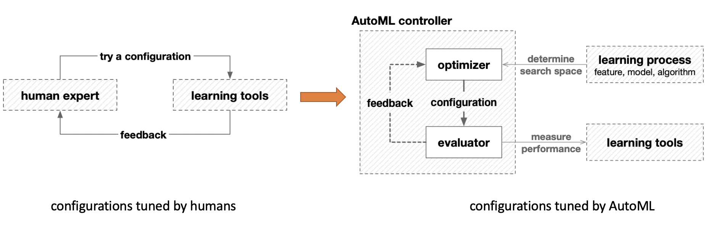
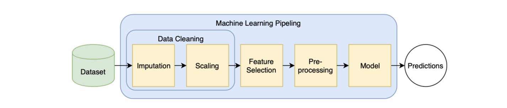
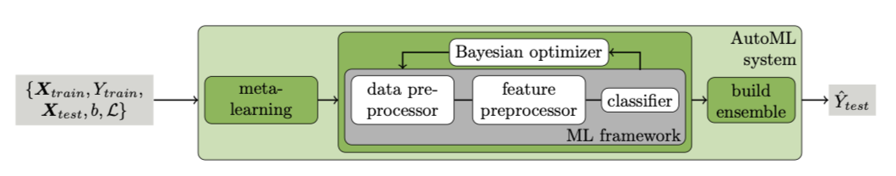
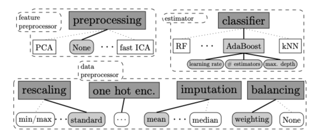
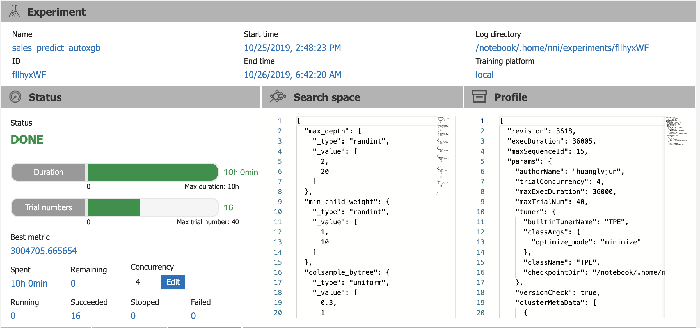
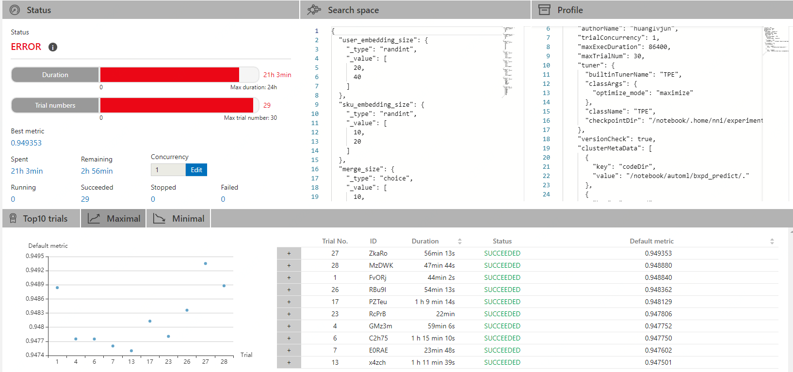

## AutomL技术调研与产品化思路

huanglvjun 20191111

### 目录

[toc]

### 什么是AutoML？

#### AutoML定义

自动机器学习(Automated Machine Learning, AutoML)是一个将==机器学习==这个用于解决现实世界问题的端到端的==处理过程==进行==自动化==的过程[^1]。

AutoML是自动化与机器学习的交叉。

- 从机器学习角度讲，AutoML 可以看作是一个在给定数据和任务上学习**泛化能力非常强大**的系统。
- 从自动化角度讲，AutoML 则可以看作是设计一系列**高级的控制系统**去操作机器学习模型，使得模型可以自动化地学习到合适的参数和配置而**无需人工干预**。 

一个通用的 AutoML 定义如下：
$$
\begin{equation}
\max_{configurations}\text{performance of learning tools,} \\
s.t. \begin{cases}
\text {no human assistance} \\
\text {limited computational budget}
\end{cases}
\end{equation}
$$
即在无人工干预和有限计算资源预算的约束下，学习到一组能够最大化模型性能的模型参数配置(configurations)。

#### 直观认识AutoML

- NAS


- 对结构化数据做出分类或数值预测

  用户界面选择label和feature列，以及模型类型(分类、回归)，自动训练好模型，并输出在验证集上的模型评估结果。发布模型，部署上线。

  **结构化数据分类或数值预测**


### 为什么需要AutoML？

1. 因为依赖人类机器学习工程师完成以下工作，需要专业知识，探索、研究、开发周期长

- 预处理数据
- 特征工程：包括特征提取、特征降维、特征选择、特征生成以及特征编码等
- 模型选择：包括算法选择、模型结构设计、超参数优化等
- 优化算法选择
- 模型评估


**而现实需求是**：

- 缩短 AI 应用投产时间：降低建模所需人员规模和技能门槛，通过自动化技术将 AI 应用构建时间缩短至数天
- 降低 AI 应用建设成本：通过标准化建模过程实现企业AI应用规模化发展，大幅削减企业拥有 AI 能力总成本
- 适应业务快速变化：利用高性能 AI 开发工具实现模型的快速迭代，灵活适应业务变化

### AutoML解决哪些问题？


#### AutoML的核心任务

- 更好地性能：在不同的输入数据和学习任务上有良好的泛化能力
- 无需人工干预
- 更低的计算开销


#### 期望实现的目标

当前：

$Solution = ML Expertise + Data + Computing Power$

未来：

$Solution = Data + Computing Power * 100$

### AutoML的研究领域

#### 按学习方法分类

- AutoML
- AutoDL

#### 按机器学习Pipeline的阶段划分

AutoML的主要目标在于对机器学习过程的不同阶段进行自动化。

1. 自动化的数据预处理
   - 自动化的列数据类型检测，例如：boolean、离散数值型、连续数值型、文本型等；
   - 自动化的列意图检测，例如：target/label、分层字段、数值型特征、类别文本特征、自由文本特征等；
   - 自动化的任务检测，例如：二分类、回归、聚类、排序等。
2. 自动化的特征工程
   - 特征选择
   - 特征提取
   - 元学习和迁移学习
   - 倾斜数据或缺失值的检测和处理
3. 自动化的模型选择
4. 学习算法和特征化的超参数优化
5. 在时间、内存和复杂度的限制下，自动化的学习管道(pipeline)选择
6. 自动化的选择模型评估度量和验证流程
7. 自动化的问题检查
   - 泄漏检测
   - 误配置检测
8. 自动化的结果分析
9. 用户自动化机器学习的用户界面和可视化

#### 按应用场景划分


### AutoML问题形式化

#### 几个基本定义

典型监督学习模型Pipeline


一个机器学习管道(Machine Learning Pipeline)是不同算法的顺序组合，它将特征向量$\vec{x} \in \mathbb{X}^{d}$ 转换成目标值$y \in \mathbb{Y}$，分类问题中的类别标签。

算法大致可以分为三类：数据清洗类算法、特征工程类算法、模型类算法。
$$
A_{cleaning} = \{A^{(1)}_{cleaning}, . . . , A^{(C)}_{cleaning}\} \\

A_{feature} = \{A^{(1)}_{feature}, . . . , A^{(F)}_{feature}\} \\

A_{model} = \{A^{(1)}_{model}, . . . , A^{(M)}_{model}\}
$$
所有算法的集合表示为：$\mathcal{A} = \{A_{cleaning} \cup A_{feature} \cup A_{model}\}$，其中每个算法$A^{(i)}$ 具有各自的超参数向量$\vec{\lambda}^{(i)} \in \Lambda^{(i)}$。


**定义1：机器学习管道(Machine Learning Pipeline)**

*设机器学习管道的结构$g \in G$为任意有向无环图(DAG)。图中每个结点(node)代表一个算法，图中每条边(edge)代表输入数据集在不同算法之间的数据流。一个机器学习管道可以表示为一个三元组$(g,\vec{A},\vec{\lambda})$，其中$\vec{A} \in \Lambda$ 为每个节点所选择算法组成的向量，$\vec{\lambda}$为每个算法对应的超参数向量。该管道表示为：$\mathcal{P}_{g, \vec{A}, \vec{\lambda}}$*


三元组$(g,\vec{A},\vec{\lambda})$称作一个配置。对于一个 $\mathcal{P}_{g, \vec{A}, \vec{\lambda}}$，需要评估其在给定数据集上的性能以确保构建的机器学习管道(ML Pipeline)具有低的泛化误差。

**定义2：管道性能(Pipelien Performance)**

*对于一个机器学习管道 $\mathcal{P}_{g, \vec{A}, \vec{\lambda}}$， $\vec{x_i}$表示特征向量，$y_i \in \mathbb{Y}$表示对应的目标值，$i = 1,...,n$。给定数据集 $D=\left\{\left(\vec{x}_{1}, y_{1}\right), \ldots,\left(\vec{x}_{n}, y_{n}\right)\right\}$ 和损失度量函数 $\mathcal{L}(\cdot, \cdot)$，  $\mathcal{P}_{g, \vec{A}, \vec{\lambda}}$ 的性能 $\pi$ 通过下式计算：*
$$
\pi=\frac{1}{n} \sum_{i=1}^{n} \mathcal{L}\left(\hat{y}_{i}, y_{i}\right)
$$
*式中，$\hat{y}_{i}=\mathcal{P}_{g, \vec{A}, \vec{\lambda}}\left(\vec{x}_{i}\right)$为管道 $\mathcal{P}_{g, \vec{A}, \vec{\lambda}}$ 对于给定样本 $\vec{x_i}$ 的预测输出。*

**注：该定义仅限于监督学习，非监督和强化学习可通过选择适当的损失函数参照以上方式进行扩展。**


**定义3：管道创建(Pipeline creation Problem)**

*给定算法集合 $\mathcal{A}$ 及其对应的超参数域 $\Lambda^{(\cdot)}$ 。将训练数据集 $D_{train} = \left\{\left(\vec{x}_{1}, y_{1}\right), \ldots,\left(\vec{x}_{n}, y_{n}\right)\right\}$ 参照k-折交叉验证的方式划分为  $\left\{D_{\text {valid}}^{(1)}, \ldots, D_{\text {valid}}^{(K)}\right\}$ 和 $\left\{D_{\text {train}}^{(1)}, \ldots, D_{\text {train}}^{(K)}\right\}$，其中$D_{t r a i n}^{(i)}=D_{t r a i n} \backslash D_{v a l i d}^{(i)}$。机器学习管道创建是指寻找一个管道结构以及构成管道的算法和算法的超参数组合，使得损失最小化*
$$
g^{\star}, \vec{A}^{\star}, \vec{\lambda}^{\star} \in \underset{g \in G, \vec{A} \in \mathcal{A}^{+}, \vec{\lambda} \in \Lambda}{\arg \min } \frac{1}{K} \sum_{i=1}^{K} \mathcal{L}\left(\mathcal{P}_{g, \vec{A}, \vec{\lambda}}\left(D_{t r a i n}^{(i)}\right), D_{v a l i d}^{(i)}\right)
$$
*式中 $\mathcal{L}\left(\mathcal{P}_{g, \vec{A}, \vec{\lambda}}\left(D_{t r a i n}\right), D_{v a l i d}\right)$ 表示在训练集 $D_{train}$ 上创建的管道 $\mathcal{P}_{g, \vec{A}, \vec{\lambda}}$ 在验证集 $D_{valid}$上进行评估的损失值。*


给定机器学习任务的数据集、损失函数和具体的任务类型(如分类、回归)，针对具体机器学习任务，机器学习管道的构建问题可以划分为以下三个子任务：

- 如何确定管道的结构，即DAG的形状？需要选择多少个数据清洗类、特征工程类和模型类算法？算法之间如何连接？数据如何流转？
- 每一个结点选择哪个具体的算法？
- 对于每个所选的算法，如何选择其超参数？


<center>机器学习管道创建问题的子问题<center/>


==是一个“黑盒优化”(black box optimization)问题。由于依赖于具体数据和任务，通常不可能预测损失函数的任何性质，甚至无法将其表达为封闭形式的表达式。因此，无法使用凸优化或基于梯度的优化等求解方式。==

#### AutoML框架的基本组成

- 搜索空间

  搜索空间定义了原则上可以选择的超参数的范围。 结合具体任务的先验知识可以减小搜索空间并简化搜索。 但是，这也引入了人为偏见，这可能会阻止寻找超越当前SOTA效果的新颖超参数组合。

- 搜索策略

  搜索策略定义了如何探索搜索空间，使用怎样的算法可以快速、准确找到最优的超参数配置。它包含了经典的探索 - 利用权衡(exploration-exploitation trade-off)。因为，一方面，需要快速找到性能良好的超参数配置，另一方面，应避免过早收敛到次优区域。

- 性能评估策略

  超参数优化的目标是为了找到能够在待预测的新数据上实现高预测性能的超参数配置。性能评估是最简单的选择是在数据集上进行标准的模型训练和模型验证，但计算成本很高，并且限制了可以探索的超参数组合的数量。 因此，最近的许多研究都集中在开发降低这些性能评估成本的方法上。



#### 算法对比

| 算法名称      | 求解方法                             | $\Lambda$ | Parallel | Timeout | 类别变量             | 连续变量 |      |
| ------------- | ------------------------------------ | --------- | -------- | ------- | -------------------- | -------- | ---- |
| Grid Search   | Grid Search                          | no        | local    | no      | yes                  |          |      |
| Random Search | Random Search                        | no        | local    | no      | yes                  |          |      |
| Spearmint     | SMBO with Gaussian process           | no        | cluster  | no      | no                   |          |      |
| RoBO          | SMBO with various models             | no        | no       | no      | no                   |          |      |
| BTB           | Bandit learning and Gaussian process | yes       | no       | no      | yes                  |          |      |
| hyperopt      | SMBO with TPE                        | yes       | cluster  | no      | --                   | yes      |      |
| SMAC          | SMBO with random forest              | yes       | local    | yes     | yes                  |          |      |
| BOHB          | Bandit learning and TPE              | yes       | cluster  | yes     | yes                  |          |      |
| Optunity      | Particle Swarm Optimization          | yes       | local    | no      | yes(mapping ->round) | yes      |      |

#### CASH算法改进

**改进方向**

- 多保真近似
  - Successive Halving (Jamieson et al., 2015)
  - Hyperband (Li et al., 2016, 2018)
  - Fabolas (Klein et al., 2016)
- 早停
  - Median stop
  - Curve Fitting
- 水平扩、并行化
- 集成学习
  - Bagging (Kaul et al., 2017; Chen et al., 2018)
  - Stacking (Wolpert, 1992)
  - Ensemble Selection (Caruana et al., 2004)
- 元学习
  - 学习超参重要性以减少搜索空间 (Probst et al., 2019)
  - Warm-Starting (Lindauer and Hutter, 2018)
  - pipeline中“黄金搭档”subpipeline (Schoenfeld et al., 2018)

### 管道结构创建

创建机器学习管道的第一个任是确定管道的结构。==  VS. NAS ==

目前尚无针对“通用Pipeline创建”的研究，一个常见的最佳实践是：
$$
\text{basic ML pipeline} = \text{数据清洗 + 特征工程 + 模型训练}
$$


#### Pipeline of fixed shape

许多AutoML框架不解决管道结构的选择问题，而是预设一个固定结构的pipeline，例如：

**[hyperparameter_hunter](https://github.com/HunterMcGushion/hyperparameter_hunter)**

**[auto_ml](https://github.com/ClimbsRocks/auto_ml)**



**优势：**

- 大大降低了确定一个图结构的复杂度，只需优化选择各个环节的基础算子。

**劣势：**

- 对于复杂的数据集，固定的管道结构可能导致性能不佳。

#### Pipeline of variable shape


### 开源工具、框架、产品

#### AutoSklearn

基于scikit-learn，采用SMAC优化算法，基于元学习进行初始化加速，利用ensemble selection方法对搜索的多个模型进行集成。





**优点：**

- 基于元学习进行初始化加速
- 利用ensemble selection方法对搜索的多个模型pipeline进行集成
- 采用的SMAC优化算法可处理结构化配置空间，减少冗余超参搜索
- 可限制单个搜索实例的运行时间和占用内存
- 禁用部分耗时较长的数据预处理组合
- 基于pSMAC进行多核并行处理或跨机器并行(依赖可读写的共享文件系统)

**缺点：**

- 缺少对多个优化算法加权利用的支持
- 不兼容用户自定义搜索空间，只支持定义基础算法的范围
- 暂不支持NAS
- 与k8s的兼容问题

#### NNI

[NNI](https://link.zhihu.com/?target=https%3A//github.com/microsoft/nni) 是由微软亚研院开源的自动机器学习工具。它是既支持神经网络架构搜索，也支持超参数搜索的工具。

**NNI 的体系结构**


- *Configuration*：配置是来自搜索空间的一个超参数组合实例，每个超参都会有一个特定的值。
- *Trial*: Trial 是一次尝试，它会使用某组配置（例如，一组超参值，或者特定的神经网络架构）。 Trial 会基于提供的配置来运行。
- *Tuner*: Tuner 是一个自动机器学习算法，会为下一个 Trial 生成新的配置。 新的 Trial 会使用这组配置来运行。
- *Assessor*：Assessor 分析 Trial 的中间结果（例如，测试数据集上的精度），来确定 Trial 是否应该被提前终止。
- *Training Platform*：是 Trial 的执行环境。 根据 Experiment 的配置，可以是本机，远程服务器组，或其它大规模训练平台（如，OpenPAI，Kubernetes）。


**优点：**

- 支持多种模型框架和基础算法库
- 多种Tunner、Assessor可选，且支持自定义
- 可以local、remote、cluster多种模式执行
- 具有Web UI，提供了较好的试验管理和对比功能

**缺点：**

- 不支持机器学习pipeline的自动创建
- 需用户配置搜索空间，无默认值
- 未利用元学习和搜索结果集成进一步优化

#### Katib

[katib](https://link.zhihu.com/?target=https%3A//github.com/kubeflow/katib)旨在实现一个云原生的超参数搜索与模型结构搜索系统，复用 Kubernetes 对 GPU 等资源的管理能力，同时保证系统的可扩展性。

**Experiment** 存储了超参数搜索或者模型结构搜索的搜索空间，以及 Trial 训练任务的模板，和优化的目标值等内容。

**Trial**是 Experiment 在确定了搜索空间中的一组参数取值后，进行的模型训练任务。它包含训练任务实例，以及训练的指标等。

**Job** 是 Kubernetes 上的一个训练实例，它是用来验证一个 Trial 中的参数的。Job 可以是 TensorFlow 模型训练任务 [TFJob](https://link.zhihu.com/?target=https%3A//github.com/kubeflow/tf-operator)，也可以是 PyTorch 训练任务 [PyTorchJob](https://link.zhihu.com/?target=https%3A//github.com/kubeflow/pytorch-operator)，也可以是以 Kubernetes batchv1/job 运行的任意框架的训练代码。

**Suggestion** 是在 Experiment 中定义的搜索空间中寻找一组参数取值的算法。寻找到的参数取值会交给 Trial 去运行。目前 kaitb 支持：

- random search
- grid search
- [hyperband](https://link.zhihu.com/?target=https%3A//arxiv.org/pdf/1603.06560.pdf)
- [bayesian optimization](https://link.zhihu.com/?target=https%3A//arxiv.org/pdf/1012.2599.pdf)
- [NAS based on reinforcement learning](https://link.zhihu.com/?target=https%3A//github.com/kubeflow/katib/tree/master/pkg/suggestion/v1alpha1/NAS_Reinforcement_Learning)
- [NAS based on EnvelopeNets](https://link.zhihu.com/?target=https%3A//github.com/kubeflow/katib/tree/master/pkg/suggestion/v1alpha1/NAS_Envelopenet)


#### **框架对比**

选择超参数优化工具应考虑哪些方面？

- 对用户训练代码的侵入行如何？是否需要大量修改代码？
- 支持哪些超参数搜索算法？
- 是否支持模型结构搜索？
- 是否支持早起停止策略？
- 算法的扩展性如何？
- 是否支持并行的试验？
- 是否支持分布式训练？
- 对资源的利用情况如何？是否支持多种平台、K8S？
- 能否收集训练指标？能收集哪些？是否支持UI？

| Framework        | CASH Slover               | Structure                      | Ensemble | Meta | Parallel | Timeout       | 侵入性   | 云原生                             | 备注                                |
| ---------------- | ------------------------- | ------------------------------ | -------- | ---- | -------- | ------------- | -------- | ---------------------------------- | ----------------------------------- |
| ML-Plan          | Grid Search               | Variable[HTN]                  | no       | no   | local    | no            |          |                                    |                                     |
| TPOT             | Genetic Prog.             | Variable[Genetic]              | no       | no   | local    | yes           |          |                                    |                                     |
| hyperopt-sklearn | hyperopt                  | Fixed[pre + alg]               | no       | no   | no       | yes           |          |                                    |                                     |
| auto-sklearn     | SMAC                      | Fixed[dc + (pre) + alg]        | yes      | yes  | cluster  | yes           |          |                                    |                                     |
| ATM              | BTB                       | Fixed[dc + pre + cl alg]       | no       | no   | cluster  | no            |          |                                    |                                     |
| auto-ml          | Grid Search/Genetic Prog. | Fixed[(dc) + (pre) + fe + alg] | yes      | no   | local    | no            |          |                                    | 支持TF、xgb                         |
| NNI              | 多种可配置                | 用户定义pipeline               | no       | no   | cluster  | yes           | 目前较高 | 较低，支持在 Kubernetes 上运行训练 | 支持多种框架                        |
| Katib            | 多种可配置                |                                | no       | no   | cluster  | yes，依赖框架 | 较低     | Kubernetes Native (深度依赖 CRD)   | 支持在TF、Pytorch，其它开发operator |
|                  |                           |                                |          |      |          |               |          |                                    |                                     |

### 应用实践案例

#### POP店铺销量预测模型(XGBoost)

**人工调参**

```json
params = {'booster':'gbtree', 'seed':0, 'nthread':-1, 'max_depth':8, 'min_child_weight':3,
         'gamma':0, 'colsample_bytree':0.8, 'colample_bylevel':0.8, 'reg_alpha':0.2, 'reg_lambda':0.83,
        'eta':0.05, 'objective':'reg:linear'}
```

**NNI搜索空间**

```json
{
    "max_depth": {"_type":"randint","_value":[2, 20]},
    "min_child_weight": {"_type":"randint","_value":[1, 10]},
    "colsample_bytree": {"_type":"uniform","_value":[0.3, 1.0]},
    "colample_bylevel": {"_type":"uniform","_value":[0.3, 1.0]},
    "gamma": {"_type":"uniform","_value":[0, 1]},
    "reg_alpha": {"_type":"choice","_value":[0.01, 0.05, 0.1, 0.2, 0.4, 0.8]},
    "reg_lambda": {"_type": "choice", "_value": [0.01, 0.05, 0.1, 0.2, 0.4, 0.8]},
    "eta": {"_type": "choice", "_value": [0.01, 0.05, 0.1, 0.2, 0.4, 0.8]}
}
```

**搜索结果**



**top10结果**


**参数对比**

trial: JMzND

```json
{
    "max_depth": 12,
    "min_child_weight": 8,
    "colsample_bytree": 0.9728148228834768,
    "colample_bylevel": 0.36295851822712805,
    "gamma": 0.6770094804085395,
    "reg_alpha": 0.1,
    "reg_lambda": 0.1,
    "eta": 0.1
}
```

trial:WAVGp

```json
{
    "max_depth": 10,
    "min_child_weight": 4,
    "colsample_bytree": 0.429576054084204,
    "colample_bylevel": 0.39685599486431106,
    "gamma": 0.9017012357057996,
    "reg_alpha": 0.4,
    "reg_lambda": 0.4,
    "eta": 0.2
}
```


**效果对比**

验证集RMSE提升23.55%。

（3930337 - 3004705）/ 3930337 =  23.55%


#### 保险推荐模型(DNN)

**NNI搜索空间**

```json
{
    "user_embedding_size": {"_type": "randint", "_value": [20, 40]},
    "sku_embedding_size": {"_type": "randint", "_value": [10, 20]},
    "merge_size": {"_type": "choice", "_value": [10, 20, 25, 30, 40, 50]},
    "user_act": {"_type": "choice", "_value": ["relu", "elu", "selu", "hard_sigmoid"]},
    "sku_act": {"_type": "choice", "_value": ["relu", "elu", "selu", "hard_sigmoid"]},
    "merge_act": {"_type": "choice", "_value": ["relu", "elu", "selu", "hard_sigmoid"]},
    "optimizer":{"_type":"choice","_value":["Adam", "SGD", "RMSprop", "Nadam"]},
    "learning_rate":{"_type":"choice","_value":[0.0001, 0.001, 0.002, 0.005, 0.01, 0.03]}
}

```

**搜索结果**



**效果对比**

验证集AUC提升0.32%。

(0.949353 - 0.946338) / 0.946338 = 0.32%

### 产品化思路

可考虑以下模式，产品形态可借鉴华为Model Arts和阿里PAI。

**模式1：人机交互**


**模式2：code free**


**模式3：集成元知识优化**

构建元知识库

- edit operations (Guu et al., 2018)
- pipeline grammar (Iddo Drori et al., 2018)
- meta features of training data
- NLP embedding of text description of the dataset and documentation for the algorithm
- meta knowledge of model trained for history tasks to warm start new task

**待进一步深入的问题：**
基于对开源自动学习学习算法和框架的调研，从是否支持pipeline的自动创建、多保真近似、早停、水平扩展、并行化、集成学习、元学习等维度对比，得出初步结论是：**AutoSklearn是一个最为完备的开源框架，KuAI第一阶段可以基于Autosklearn框架解决传统机器学习模型自动化学习问题（包括pipeline的自动化创建、超参数自动调优和模型自动集成）。**

为实现最终产品化落地，需进一步深入搞明白AutoSkearn以下几个方面的问题：

1. AutoSkearn完全自动化生成模型，能否支持用户自定义超参数搜索空间？如何支持？
2. 提取出AutoSkearn中计算数据元特征的模块，对用户训练数据进行元特征计算
3. AutoSkearn的基础算法的选择范围是如何定义的？能否支持XGBoost、LightGBM、CatBoost等先进算法？是否支持自定义？
4. AutoSkearn的超参优化算法采用的是SMAC，能否像hyperopt-sklearn一样支持多优化算法集成？是否支持自定义？
5. AutoSkearn支持分布式训练，其原理机制是什么？如何基于容器平台进行资源分配调度？
6. AutoSkearn预置的pipeline模板(data clean + preprocessing + model selection)是如何实现的？是否支持自定义？
7. AutoSkearn自动创建pipeline时，是否考虑了pipeline语法约束？如何嵌入语法约束？
8. 从产品化角度考虑AutoML落地的具体形态，支持”无代码模式“还是”人机协作式“还是两者都支持？

### AutoML下一步

- 性能优化（搜索算法优化、分布式训练kubeflow集成）
- NAS支持