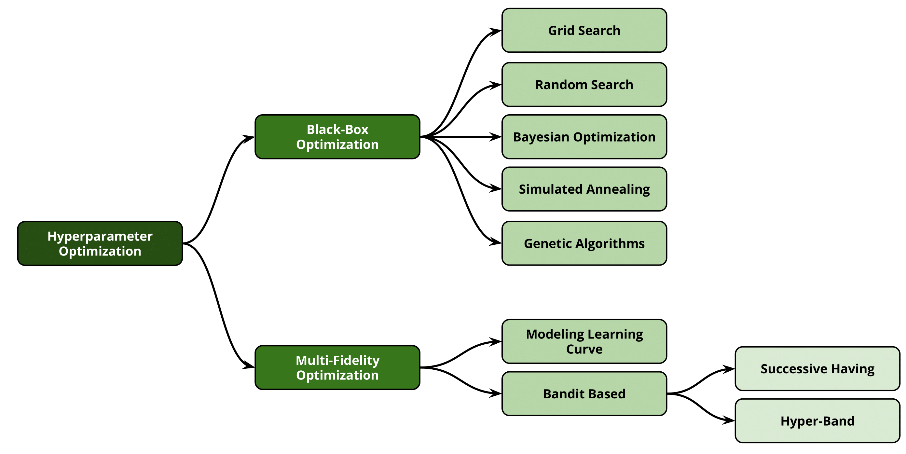
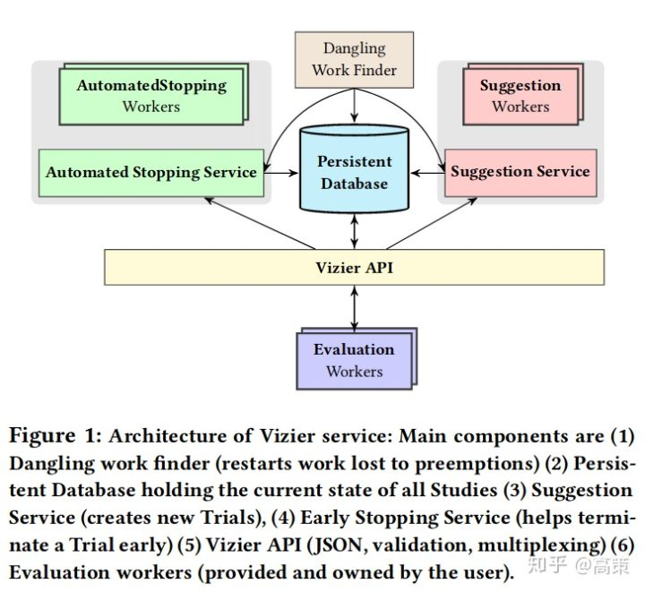
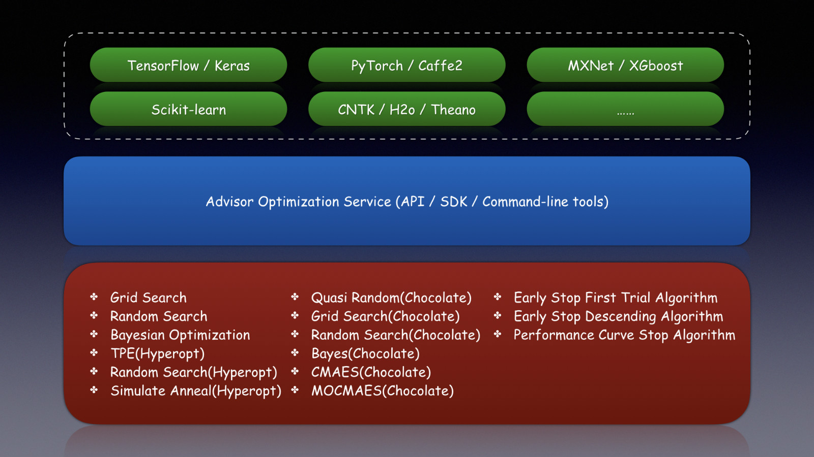

## 自动超参数优化

近期对具有大量超参数的复杂的、计算开销极大的机器学习模型的兴趣引发了大家对超参数优化(hyperparameter optimization, HPO)的研究。

超参数搜索与模型结构搜索，一定程度上，是可通用的算法。因此目前也有许多自动机器学习系统，帮助算法科学家们更方便地进行自动机器学习。

### 自动超参数优化的意义

自动超参数优化具有重要意义，它能够：

- 降低应用机器学习时人类投入的必要性。这在AutoML环境中尤为重要。
- 提高机器学习算法的性能。在多项研究中，自动超参数优化已经使得模型取得了新的SOTA性能表现。
- 提高科学研究的可重复性和公平性。自动超参数优化比人工调参更容易复现结果，也方便对同一问题不同的方法进行公平的比较。
- 创造商业价值：由于使用机器学习的公司不断增加，超参数优化的商业价值也逐渐凸显，起到更大的作用，例如：
  - 作为公司内部的工具。
  - 作为机器学习云服务的一部分。
  - 单独作为一项服务。

### 自动超参数优化面临的挑战

- 对于大规模的模型、复杂的机器学习流水线或大规模数据集而言，需要评估的空间规模非常大
- 配置空间很复杂(包含连续、类别、条件超参数)且是高维空间
- 无法或者很难利用损失函数的梯度变化，无法运用在经典优化问题上目标函数的某些特性，如凸函数、平滑等
- 由于训练集规模的限制，难以直接优化泛化性能

### 超参数优化问题的形式化

超参数优化问题可以被形式化地表示为在给定的多维搜索空间下的黑盒优化问题。对于单一的超参数而言，其可能是离散的值，如激活函数的选择等，也有可能是连续的值。而由于超参数的数量不确定，因此搜索空间是多维的。而由于对于超参数训练而言，输入的参数与输出是相互独立的变量，因此属于黑盒优化的范畴。

模型参数是模型内部的配置变量，可以用数据估计模型参数的值；模型超参数是模型外部的配置，必须手动设置参数的值。

**优化目标**

**超参数域**

实数(如学习率)、整数(如网络的层数)、0-1逻辑值(如是否采用early-stoping)、类别(优化器的选择)等。除了少数例外情况，实数、整数类型的超参数一般是有界的。

**参数空间的条件性**

一个参数的取值可能与其他参数的取值有关。

**评估所选择的超参数组合在验证集上的性能**

留出法(holdout)

交叉验证

降低评估时间的策略

- foldds的子集
- 数据集的子集
- 较小的迭代次数


#### 优化中的集成

超参数配置的集成


超参数优化后多个模型的集成


集成模型的直接优化


#### 多目标优化

在实际应用中，存在模型性能、资源消耗、多个损失函数等多目标直接的权衡。

1. 带约束条件的优化问题

2. 多目标优化搜索Pareto front

### 超参数优化方法

超参数优化方法包括：

Hyperparameter Optimization

- Black-Box Optimization
  - Grid Search
  - Random Search
  - Bayesian Optimization
  - Simulated Annealing
  - Genetic Algorithms
- Multi-Fidelity Optimization
  - Model Learning Curve
    - weighted combination of 11 parametric functions + Markovchain Monte Carlo
    - Freeze-Thaw Bayesian Optimization
  - Bandit Based
    - Successive Having
    - HyperBand
    - BOHB (Bayesian Optimization + HyperBand)



#### 黑箱函数优化方法

基于model-free方法的黑箱函数优化方法(black-box function optimization	)

将决策网络当作是一个黑盒来进行优化，仅关心输入和输出，而忽略其内部机制。

**网格搜索 (grid search)**：是一种通过遍历给定的参数组合来优化模型表现的方法，表现最好的参数组合就是最终的结果。算法思路及实现方式都很简单，但经过笛卡尔积组合后会扩大搜索空间，并且在存在某种不重要的超参数的情况下，网格搜索会浪费大量的时间及空间做无用功，因此它只适用于超参数数量小的情况。

网格搜索的问题是很容易发生维度灾难，优点是很容易并行。

**随机搜索 (random search)**：随机搜索首先为每类超参数定义一个边缘分布，通常取均匀分布，然后在这些参数上采样进行搜索。随机搜索虽然有随机因素导致搜索结果可能特别差，但是也可能效果特别好。总体来说效率比网格搜索更高，但是不保证一定能找到比较好的超参数。

随机搜索是利用随机数求极小点而求得函数近似的最优解的方法。

#### 贝叶斯优化方法

##### 贝叶斯优化概述

贝叶斯优化是一种迭代的优化算法，包含两个主要的元素，输入数据假设的模型和一个采集函数用来来决定下一步要评估哪一个点。每一步迭代，都使用所有的观测数据fit模型，然后利用激活函数预测模型的概率分布，决定如何利用参数点，权衡是Explaoration还是Exploitation。相对于其它的黑盒优化算法，激活函数的计算量要少很多，这也是为什么贝叶斯优化被认为是更好的超参数调优的算法。

##### **surrogate model** 

- [Gaussian Processes](https://en.wikipedia.org/wiki/Gaussian_process)
-  [Random Forest Regressions](http://aad.informatik.uni-freiburg.de/papers/13-GECCO-BBOB_SMAC.pdf)
- Tree Parzen Estimators (TPE) 

##### Acquisition Functions

- Expected Improvement
- entropy search & predictive entropy search
- knowledge gradient

##### 贝叶斯优化工具


##### 贝叶斯优化未来研究方向

#### multi-fidelity优化技术

不断增加数据集规模和模型复杂度是超参数优化的主要障碍，因为它们使得基于黑箱函数方法评估模型性能变得成本高昂。multi-fidelity优化技术采用比黑箱函数方法更轻量级的方法，近似地对超参数设置的质量进行评估，降低计算开销。

**常见的加速人工调优过程的技术**：通过在采用较小数据集、训练较少的迭代次数、在特征子集上训练、使用较少的数据进行交叉验证、对计算机视觉中的图像进行下采样等方法探索算法/超参数配置。

**”多保真“(multi-fidelity)方法**通过使用对实际损失函数最小化的低保真近似将人工的探索过程转化为正式的算法。这种近似权衡了模型优化性能和运行时长，但在实际中，获得的加速超过了近似误差。

- 基于学习曲线预测的早停策略

  通过对一个算法学习过程中学习曲线的建模，如果加入额外的资源被预测为不会带来算法效果的提升，则提前终止训练过程。

  学习曲线: 同一超参数配置的模型在逐步增加的训练集上的性能表现，或者是在模型在迭代训练过程中每次迭代上的性能表现。

  关键在于：如何定义学习曲线？如何对学习曲线进行建模？如何通过学习曲线得到最优参数组合？

  **方法一：有参函数的加权组合**

  **学习曲线的建模**

  来自于不同科学领域的11个有参函数的加权组合。这些函数的参数和权重通过Markovchain Monte Carlo方法采样以最小化拟合部分观测学习曲线的损失。

  ==11个有参函数是如何得到的？如何选择参数和权重？==

  

  **方法二：Freeze-Thaw 贝叶斯优化** 

  通过regular高斯过程模型一个收敛算法的性能，引入一个特殊的协方差函数来模拟学习曲线。

  

- 算法选择方法

  仅从给定算法/超参数配置空间的有限集合中进行选择。

- 多保真方法

  主动的决定为了找到最优的超参数，哪个fidelity能够提供最多的信息。

### 超参数优化的工具/产品

选择超参数优化工具应考虑哪些方面？

- 对用户训练代码的侵入行如何？是否需要大量修改代码？
- 支持哪些超参数搜索算法？
- 是否支持模型结构搜索？
- 是否支持早起停止策略？
- 算法的扩展性如何？
- 是否支持并行的试验？
- 是否支持分布式训练？
- 对资源的利用情况如何？是否支持多种平台、K8S？
- 能否收集训练指标？能收集哪些？是否支持UI？

**工具对比**

|                        | katib                                                  | advisor                    | NNI                                | Google Vizier           |
| ---------------------- | ------------------------------------------------------ | -------------------------- | ---------------------------------- | ----------------------- |
| 并行的 Trial           | 支持                                                   | 支持                       | 支持                               | 支持                    |
| 集群资源利用           | 支持 Kubernetes                                        | 不支持                     | 支持多种平台                       | 支持 Google DataCenters |
| 分布式训练支持         | 支持                                                   | 不支持（？）               | 支持                               | 支持                    |
| 超参数搜索算法支持     | 目前较少                                               | 较多                       | 较多                               | 未知                    |
| 算法的扩展性           | 较高                                                   | 较高                       | 较高                               | 较高                    |
| 早期停止策略支持       | 目前较差，依赖框架层面                                 | 目前较差，依赖框架层面     | 较好                               |                         |
| 模型结构搜索支持       | 目前较差                                               | 无                         | 较高                               | 无                      |
| 训练指标收集方式       | 目前支持 Pull-based，后续支持 Push-based 和 Pull-based | Pull-based                 | Push-based                         | 未知                    |
| 对用户训练代码的侵入性 | 较低                                                   | 较低                       | 目前较高                           | 未知                    |
| 云原生                 | Kubernetes Native (深度依赖 CRD)                       | 较低，支持 Kubernetes 部署 | 较低，支持在 Kubernetes 上运行训练 | 闭源产品                |
| 开源许可               | Apache 2.0                                             | Apache 2.0                 | MIT                                | 闭源                    |


#### 黑盒优化的一些工具

- hyperopt(http://t.cn/RyJDbzH)

  hyperopt 是一个Python库，可以用来寻找实数,离散值,条件维度等搜索空间的最佳值

- Google Vizier

  Google的内部的机器学习系统 Google Vizier能够利用迁移学习等技术自动优化其他机器学习系统的超参数

- advisor(http://t.cn/RpTEMhK)

  Google Vizier的开源实现

- katib (http://t.cn/EvQJWbq)

  基于Kubernetes的超参数优化工具

- Skopt
  https://scikit-optimize.github.io/
  是一个超参数优化库，包括随机搜索、贝叶斯搜索、决策森林和梯度提升树。这个库包含一些理论成熟且可靠的优化方法，但是这些模型在小型搜索空间和良好的初始估计下效果最好。
  Hyperopt
  https://github.com/hyperopt/hyperopt-sklearn
  是一个超参数优化库，针对具有一定条件或约束的搜索空间进行调优，其中包括随机搜索和Tree Parzen Estimators（贝叶斯优化的变体）等算法。它使用MongoDb作为存储超参数组合结果的中心结构，可实现多台电脑的并行计算。这个库是用hyperopt-sklearn和hyperas实现的，这两个用于模型选择和优化的函数库分别建立在scikit-learn和keras的基础上。
  Simple(x)
  https://github.com/chrisstroemel/Simple
  一个优化库，可作为贝叶斯优化的替代方法。Simple(x)和贝叶斯搜索一样，试图以尽可能少的样本进行优化，但也将计算复杂度从n³降低到log(n)，这对大型搜索空间非常有用。这个库使用单形（n维三角形），而不是超立方体（n维立方体），来模拟搜索空间，这样做可以避开贝叶斯优化中具有高计算成本的高斯过程。
  Ray.tune
  https://github.com/ray-project/ray/tree/master/python/ray/tune
  是一个超参数优化库，主要适用于深度学习和强化学习模型。它结合了许多先进算法，如Hyperband算法（最低限度地训练模型来确定超参数的影响）、基于群体的训练算法（Population Based Training，在共享超参数下同时训练和优化一系列网络）、Hyperopt方法和中值停止规则（如果模型性能低于中等性能则停止训练）。这些都运行在Ray分布式计算平台上，这让它具有很强的扩展性。
  Chocolate
  https://github.com/AIworx-Labs/chocolate
  是一个分布式超参数优化库（支持计算机集群的并行运算且无需中央主机），它使用通用数据库来联合执行各个任务。它还支持网格搜索、随机搜索、准随机搜索、贝叶斯搜索和自适应协方差矩阵进化策略。它的优势体现在它支持受约束的搜索空间和多损失函数优化（多目标优化）。
  GpFlowOpt
  https://github.com/GPflow/GPflowOpt
  一个基于GpFlow库的高斯过程优化器，可使用TensorFlow在GPU上运行高斯过程任务。你如果要用到贝叶斯优化且有可用的GPU计算资源，那GpFlowOpt库应该是理想之选。
  FAR-HO
  https://github.com/lucfra/FAR-HO
  运行在TensorFlow上，包含一系列基于梯度的优化器，包括Reverse-HG和Forward-HG。这个库旨在构建TensorFlow中基于梯度的超参数优化器的访问，允许在GPU或其他张量优化计算环境中进行深度学习模型的训练和超参数优化。
  Xcessiv
  https://github.com/reiinakano/xcessiv
  支持大规模模型开发、执行和集成。它的优势在于能够在单个GUI界面中管理多个机器学习模型的训练、执行和评估。它具有多个集成工具来组合这些模型，以实现最佳性能。它包括一个贝叶斯搜索参数优化器，这个优化器支持高级别并行计算，还支持与TPOT库的集成。
  HORD
  https://github.com/ilija139/HORD
  一个用于超参数优化的独立算法，它能为需要优化的黑盒模型生成一个代理函数，并用它来生成最接近理想状态的超参数组合，以减少对整个模型的评估。与Tree Parzen Estimators、SMAC和高斯过程方法相比，它始终具有更高的一致性和更低的错误率，而且这个方法特别适用于极高维数据分析。
  ENAS-pytorch
  https://github.com/carpedm20/ENAS-pytorch
  可在pytorch中实现高效的深度学习结构搜索。它使用参数共享来构建更高效的网络，使其适用于深度学习结构搜索。
  ------------------------------------------------
  版权声明：本文为CSDN博主「shaquexlxfreedom」的原创文章，遵循 CC 4.0 BY-SA 版权协议，转载请附上原文出处链接及本声明。
  原文链接：https://blog.csdn.net/weixin_40255359/article/details/82193887

#### Google Vizier

Google Vizier 对超参数搜索问题进行了非常好的抽象，并且基于此实现了谷歌内部的超参数搜索系统。




Google Vizier 服务架构图


#### advisor

advisor是Google Vizier超参数调优的开源实现。



##### advisor使用

```
 docker run -it --net=host tobegit3hub/advisor bash
 
 export ADVISOR_ENDPOINT="http://127.0.0.1:8000"
 
 advisor study list
 
 advisor study describe -s "demo"
 
 advisor trial list --study_name "demo"  
 
 advisor_admin server start
 
 advisor_admin server stop
```

### 超参数优化的未来研究方向