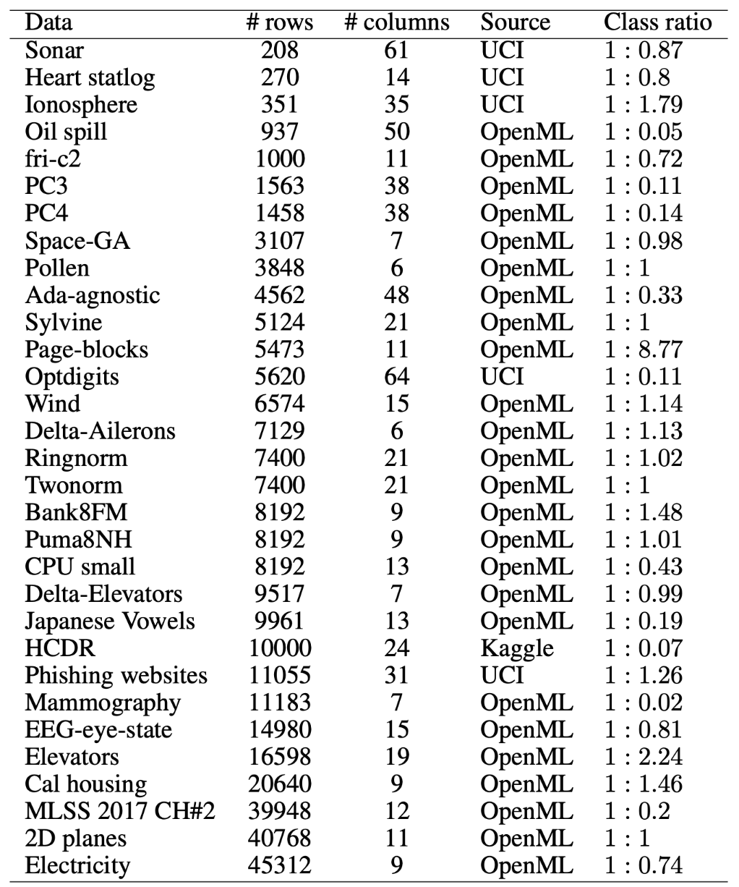
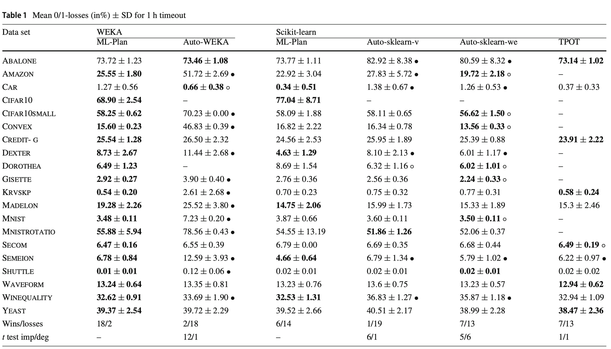

# AutoML框架介绍


## Data Science Machine(DSM)

## ExploreKit

## FeatureHub

## FeatureTools

## Auto-WEKA

Auto-WEKA是最早的一个AutoML库，于2013年首次发布，用于自动模型选择和超参数选择。

CASH问题

贝叶斯优化

SMBO(Sequential Model-based Optimization)

SMAC

## Hyperopt-Sklearn

## Auto-sklearn

github地址：https://github.com/automl/auto-sklearn， 4k star

官方文档：https://automl.github.io/auto-sklearn

将Auto-WEK扩展至python。

进行机器学习算法的自动选择与超参数的自动优化，使用的技术包括贝叶斯优化、元学习和模型集成(ensemble construction)。

### 支持范围

- 16 classifiers

  （可以被指定或者筛选，include_estimators=[“random_forest”, ]）

  - adaboost, bernoulli_nb, decision_tree, extra_trees, gaussian_nb, gradient_boosting, k_nearest_neighbors, lda, liblinear_svc, libsvm_svc, multinomial_nb, passive_aggressive, qda, random_forest, sgd, xgradient_boosting

- 13 regressors

  （可以被指定或者筛选，exclude_estimators=None）

  - adaboost, ard_regression, decision_tree, extra_trees, gaussian_process, gradient_boosting, k_nearest_neighbors, liblinear_svr, libsvm_svr, random_forest, ridge_regression, sgd, xgradient_boosting

- 18 feature preprocessing methods

  （这些过程可以被手动关闭全部或者部分，include_preprocessors=[“no_preprocessing”, ]）

  - densifier, extra_trees_preproc_for_classification, extra_trees_preproc_for_regression, fast_ica,feature_agglomeration, kernel_pca, kitchen_sinks, liblinear_svc_preprocessor, no_preprocessing, nystroem_sampler, pca, polynomial, random_trees_embedding, select_percentile, select_percentile_classification, select_percentile_regression, select_rates, truncatedSVD

- 5 data preprocessing methods

  （这些过程不能被手动关闭）

  - balancing, imputation, one_hot_encoding, rescaling, variance_threshold

- **more than 110 hyperparameters**
  其中参数include_estimators,要搜索的方法,exclude_estimators:为不搜索的方法.与参数include_estimators不兼容
  而include_preprocessors,可以参考手册中的内容

### 训练数据中字段的数据类型

#### 支持哪些数据类型？指定字段数据类型时的可选范围？

新版本的scikit-learn支持直接使用string数据类型，Autosklearn尚未更新其依赖的scikit-learn。目前0.5.2版本需将类别型数据转换为int，将字符、文本型进行encoding。

经测试，特征列和标签列均需可直接转换为float。

#### 缺失值处理

需将缺失值置为np.NaN，


数据预览支持的数据类型：数值、类别、日期、文本（int、float、string）

特征列和标签列支持的数据类型：数值、类别（int、float）


第二个临时目录的作用：

folder to store predictions for optional test set, if `None` automatically use `/tmp/autosklearn_output_$pid_$random_number`


### 应用

#### 分类模型自动学习

```python
class autosklearn.classification.AutoSklearnClassifier(time_left_for_this_task=3600, per_run_time_limit=360, initial_configurations_via_metalearning=25, ensemble_size: int = 50, ensemble_nbest=50, ensemble_memory_limit=1024, seed=1, ml_memory_limit=3072, include_estimators=None, exclude_estimators=None, include_preprocessors=None, exclude_preprocessors=None, resampling_strategy='holdout', resampling_strategy_arguments=None, tmp_folder=None, output_folder=None, delete_tmp_folder_after_terminate=True, delete_output_folder_after_terminate=True, shared_mode=False, n_jobs: Optional[int] = None, disable_evaluator_output=False, get_smac_object_callback=None, smac_scenario_args=None, logging_config=None, metadata_directory=None)
```


#### 回归模型自动学习

```python
class autosklearn.regression.AutoSklearnRegressor(time_left_for_this_task=3600, per_run_time_limit=360, initial_configurations_via_metalearning=25, ensemble_size: int = 50, ensemble_nbest=50, ensemble_memory_limit=1024, seed=1, ml_memory_limit=3072, include_estimators=None, exclude_estimators=None, include_preprocessors=None, exclude_preprocessors=None, resampling_strategy='holdout', resampling_strategy_arguments=None, tmp_folder=None, output_folder=None, delete_tmp_folder_after_terminate=True, delete_output_folder_after_terminate=True, shared_mode=False, n_jobs: Optional[int] = None, disable_evaluator_output=False, get_smac_object_callback=None, smac_scenario_args=None, logging_config=None, metadata_directory=None)[source]
```


### 优缺点

优点：

- Auto-Sklearn支持切分训练/测试集的方式，也支持使用交叉验证，从而减少了训练模型的代码量和程序的复杂程度
- 支持资源约束配置，如时长、内存大小限制
- Auto-Sklearn支持加入扩展模型以及扩展预测处理方法

缺点：

- 不支持深度学习，但是貌似会有AutoNet出来，像谷歌的cloud AutoML那样
- 计算时长往往一个小时以上
- 在数据清洗这块还需要人为参与，目前对非数值型数据不友好
- Auto-Sklearn输出携带的信息较少，如果想进一步训练只能重写代码。

## TPOT

github地址：https://github.com/EpistasisLab/tpot， 6.4k star

官方文档：http://epistasislab.github.io/tpot/

基于遗传算法优化机器学习Pipeline。


​                                                               机器学习pipeline优化示意图 来源：[TPOT](http://epistasislab.github.io/tpot/)


## Auto_ml

## Auto-Net

## ML4AAD

Machine Learning for Automated Algorithm Design

## Automatic Statistician

## Auto-Keras

github地址：https://github.com/keras-team/autokeras， 6.2k star

官方文档：https://autokeras.com/

是一个专门用来进行模型结构搜索的库。它提供了模型结构搜索的基准实现，其中包括随机搜索，网格搜索，贪心算法和贝叶斯优化等。与此同时，它允许用户自行定义新的模型结构搜索算法，并且集成在 [auto-keras](https://link.zhihu.com/?target=https%3A//autokeras.com/) 中。

- [ImageClassifier](https://autokeras.com/task/#imageclassifier)

- [ImageRegressor](https://autokeras.com/task/#imageregressor)

- [TextClassifier](https://autokeras.com/task/#textclassifier)

- [TextRegressor](https://autokeras.com/task/#textregressor)

- StructuredDataClassifier

  StructuredDataRegressor

## [H2O AutoML](<http://docs.h2o.ai/h2o/latest-stable/h2o-docs/automl.html>)

使用强化学习进行 Neural Architecture Search

## NNI

[nni](https://link.zhihu.com/?target=https%3A//github.com/microsoft/nni) 是由微软亚研院开源的自动机器学习工具。它是既支持模型结构搜索，也支持超参数搜索的工具。它为模型结构搜索实现了一个[统一的接口](https://link.zhihu.com/?target=https%3A//github.com/microsoft/nni/blob/master/docs/en_US/AdvancedFeature/GeneralNasInterfaces.md)，相比于其他的工具，具有更好的易用性。

Python auto_ml(http://t.cn/Ri1Ch74)


## katib

提交任务

**v1alpha1版本**

通过katibcli命令行工具提交超参数调优任务，在katibcli参数中分别指定study、worker、suggestion的yaml配置文件。

**v1alpha2版本**

通过kubectl工具提交。

```sh
kubectl apply -f random-example.yaml
```

Web UI

katib提供了一个Web UI，能够可视化超参数空间的一般趋势和每次训练历史。

katib 的设计与实现

<https://zhuanlan.zhihu.com/p/77760872>

## ATM

## ATMSeer

增加Auto ML的透明性和可控性。

[ATMSeer](<https://github.com/HDI-Project/ATMSeer>)

# AutoML框架评估对比 

总结评估对比方法、评估数据集和评估结果。

回归问题：

- Houses(https://www.openml.org/d/537)

  20640*9

- fried(https://www.openml.org/d/564)

  40768*11

- puma32H(https://www.openml.org/d/308)

  8192*33

多分类：

- Mnist(https://www.openml.org/d/554)
- Cifar10(https://www.openml.org/d/40927)
- artificial-characters(https://www.openml.org/d/1459)

二分类：

- gisette(https://www.openml.org/d/41026)

- madelon(https://www.openml.org/d/1485)

- numerai28.6(https://www.openml.org/d/23517)

- KDDCup09_appetency(https://www.openml.org/d/1111)

  顾客购买某款服务或产品的倾向。

  训练集包含50000个样本，190个数值型特征变量，40个类别型特征变量。

## 对比研究一

Balaji, A. and A. Allen (2018). "Benchmarking Automatic Machine Learning Frameworks." arXiv: Learning.

在OpenML数据集上评估对比auto- sklearn, TPOT, auto ml,  H2Os四个AutoML框架。

### 数据集

从OpenML上选择了57个分类数据集和30个回归数据集。==所选数据集没有以任何方式被4个AutoML框架中任意一个内部使用。==

训练集和测试集如何划分的？

- **回归问题数据集**


- **分类问题数据集**

  

### 评估方法

**评估指标**：MSE和F1 score (weighted)

生成10个随机数种子，对于auto- sklearn, TPOT, auto ml,  H2Os四个AutoML框架在87个数据集上进行试验评估，共计3480个试验项目(10 seeds * 4 frameworks * 87 datasets)。

基于各框架运行时间的综合调研，为每个试验设定运行时长为3～3.5小时，共计需要10440小时，因此采用分布式执行方式进行试验评估。

### 评估结果

**结论**：

1. 在分类问题上，Auto-sklearn效果最佳，在回归问题上，TPOT效果最佳。
2. 各框架的评估指标的方差较大，框架本身不稳定。

|  |  |
| ------------------------------------------------------------ | ------------------------------------------------------------ |
|  |  |

## 对比研究二

Liu, S., et al. (2019). "An ADMM Based Framework for AutoML Pipeline Configuration." arXiv preprint arXiv:1905.00424.

### 数据集

30 binary classification datasets from the UCI ML (Asuncion and Newman 2007) & OpenML repositories (Bischl and others 2017), and Kaggle


1. **Connectionist Bench (Sonar, Mines vs. Rocks) Data Set**

   [http://archive.ics.uci.edu/ml/datasets/Connectionist+Bench+%28Sonar%2C+Mines+vs.+Rocks%29](http://archive.ics.uci.edu/ml/datasets/Connectionist+Bench+(Sonar%2C+Mines+vs.+Rocks))	

2. **Statlog (Heart) Data Set**

   [http://archive.ics.uci.edu/ml/datasets/Statlog+%28Heart%29](http://archive.ics.uci.edu/ml/datasets/Statlog+(Heart))

3. **Ionosphere Data Set**

   http://archive.ics.uci.edu/ml/datasets/Ionosphere

4. **Optical Recognition of Handwritten Digits Data Set**

   http://archive.ics.uci.edu/ml/datasets/Optical+Recognition+of+Handwritten+Digits

5. **Phishing Websites Data Set**

   http://archive.ics.uci.edu/ml/datasets/Phishing+Websites

6. oil_spill

   https://www.openml.org/d/311

7. fri-c2【未找到】

8. pc3

   https://www.openml.org/d/1050

9. pc4

   https://www.openml.org/d/1049

10. Space-GA【未找到】

11. pollen

    https://www.openml.org/d/871

12. Ada-agnostic

    https://www.openml.org/d/40993

13. Sylvine

    https://www.openml.org/d/41146

14. Page-blocks

    https://www.openml.org/d/1021

15. Wind

    https://www.openml.org/d/847

16. Delta-Ailerons【未找到】

17. Ringnorm

    https://www.openml.org/d/1496

18. Twonorm

    https://www.openml.org/d/1507

19. Bank8FM

    https://www.openml.org/d/725

20. Puma8NH

    https://www.openml.org/d/816

21. CPU small

    https://www.openml.org/d/796

22. Delta-Elevators

    https://www.openml.org/d/846

23. Japanese Vowels

    https://www.openml.org/d/375

24. HCDR【未找到，Kaggle】

25. Mammography

    https://www.openml.org/d/310

26. EEG-eye-state

    https://www.openml.org/d/1471

27. Elevators

    https://www.openml.org/d/846

28. Cal housing

    https://www.openml.org/d/823

29. MLSS 2017 CH【未找到】

30. 2D planes

31. Electricity

    https://www.openml.org/d/151




### 评估方法

评估指标： 1 − AUROC

### 评估结果


## 对比研究三

Olson, R. S. and J. H. Moore (2019). "TPOT: A Tree-Based Pipeline Optimization Tool for Automating." Automated Machine Learning: Methods, Systems, Challenges: 151.

### 数据集

在150个二分类或多分类数据集上进行评估，按75%：25%比例划分训练集和测试集。

数据集地址：http://www.randalolson.com/data/benchmarks/

### 评估方法

与具有500棵树的随机森林进行对比，在每个数据集上重复30次。

### 评估结果

**结论**：

1. 在21个数据集上显著优于Random Forest，在4个数据集上显著次于Random Forest，在125个数据集上与Random Forest无显著差异。


## 对比研究四

Mohr, F., et al. (2018). "ML-Plan: Automated Machine Learning via Hierarchical Planning." Machine Learning **107**(8): 1495-1515.

### 数据集

20个OpenML数据集，每个数据重跑20次。每次超时时长为1小时或1天，超过限定时长的110%，则强制终止；内部当个方案的评估时间为5～20分钟。8核32G内存，超过资源限制则终止。

### 评估方法

### 评估结果

1. ML-Plan显著优于Auto-WEKA
2. ML-Plan显著优于vanilla版本的Auto-sklearn，但与集成了warm start 和 ensemble的Auto-sklearn相比，没有明显优势，这也说明了warm start 和 ensemble的重要作用。


- 1小时超时时长，20次重复运行的平均0/1-loss和方差

  实心点表示ML-Plan显著优于该方法，空心圈表示ML-Plan显著劣于该方法。

  Auto-sklearn-v：vanilla

  Auto-sklearn-we：warm start 和 ensemble



- 1天超时时长，20次重复运行的平均0/1-loss和方差


- 分析HTN、Monte Carlo cross-validation和the selection phase对ML-Plan的影响


## 对比研究五

Hutter, F., et al. (2019). Automated Machine Learning-Methods, Systems, Challenges, Springer. 第六章

### 数据集


### 评估方法

### 评估结果


